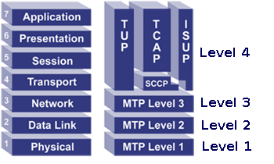
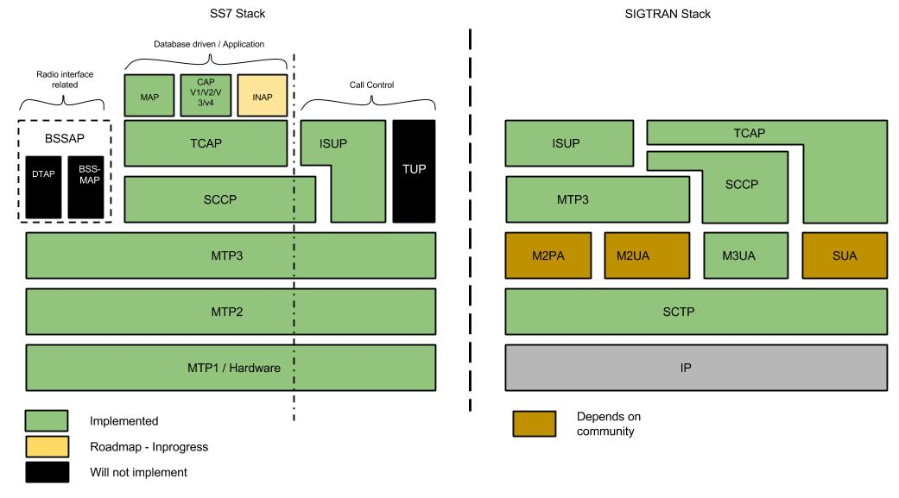

= Introduction

[[_jss7_overview]]
== {this-platform} {this-application} 

{this-platform} {this-application} is the only Open Source Java based implementation of the SS7 protocol stack.
It provides implementation for `MTP2`, `MTP3`, `ISUP`, `SCCP`, `TCAP`, `CAMEL (Phase I, Phase II, Phase III and Phase IV)` and `MAP` protocols for a dedicated equipment.
It also has in-built support for `SIGTRAN (M3UA)` over IP and strictly adheres to the standards and specifications defined by the International Telecommunications Union (ITU) and American National Standards Institute (ANSI). The platform offers developers with a flexible API set that hides the lower layer details (legacy SS7 links or SIGTRAN) and therefore makes it simple and easy to develop SS7 applications as well as to migrate your applications from TDM equipments to M3UA. {this-platform}  {this-application}  is based on an easily scalable and configurable load-balancing architecture. 

{this-platform} {this-application} supports TDM hardware offered by major vendors in the market, namely Intel family boards (Dialogic) and  Zaptel/Dahdi (Digium, Sangoma).    

If you intend to use only `M3UA` you can install the {this-application}  on any Operating System that supports Java.
However if you wish to use SS7 cards, the native libaries for these are only compiled for Linux at the moment. {this-platform}  {this-application}  can work as a standalone library.
However if you wish to use JSLEE Resource Adapters, the Command Line Interface (Shell Management tool) or the GUI Management Console for run-time configuration, then you must have JBoss Application Server installed and running. {this-platform}  {this-application}  comes with JSLEE TCAP, MAP, CAP and ISUP Resource Adaptors (RA) that enable developers to build SS7  applications with ease.
Developers only require an understanding of Resource Adaptors and can focus on building applications quickly and efficiently rather than worry about the SS7 stack. 

The Open Source Software gives you the flexibility to understand the readily available source code and customise the product for your Enterprise needs. 

This guide provides details on configuring and using the platform and information regarding the supported protocols and compliant standards.
For installation instructions, please refer to the Installation Guide published along with this.
 

[[_ss7_overview]]
== About SS7

SS7 (Signaling System No.7) is a set of signaling protocols defined for information exchange in telephony.
It is the global standard for telecommunications and is defined by the http://www.voip-info.org/wiki/view/ITU[International Telecommunication Union (ITU) - Telecommunication Standardization Sector (ITU-T)].
It is also commonly referred to as Common Channel Signaling System No.
7 (i.e., SS7 or C7). 

In telephony (wireless and wireline), the information associated with a call must be exchanged between a telephone and the telephone exchange or between exchanges, transit nodes and other elements in the network.
Information exchange is required to set up, control and tear down calls and this exchange of information is called Signaling.
SS7 is the global standard that defines the procedures and protocol to be followed by network elements in the Public Switched Telephone Network (PSTN) in order to exchange information over a digital signaling network to effect wireless (cellular) and wireline call setup, route,control, monitor and terminate.
 
The ITU definition of SS7 allows for national variants such as the American National Standards Institute (ANSI) and Bell Communications Research (Telcordia Technologies) standards used in North America and the European Telecommunications Standards Institute ( http://www.voip-info.org/wiki/view/ETSI[ETSI] ) standard used in Europe. 

The hardware and software functions of the  protocol are divided into functional abstractions called "levels". These levels map loosely to the Open Systems Interconnect (OSI) 7-layer model defined by the http://www.iso.ch/[International Standards Organization (ISO)]. 

[[_jss7_implemented_protocols]]
== Implemented Protocols and Standards Compliance

{this-platform} {this-application} is a software based implementation of the SS7 protocol.
It provides implementation for Level 2 and above in the SS7 protocol Stack.
The {this-platform} {this-application} is a platform in the sense that it does not provide the application itself but rather allows users to build their own SS7 applications using {this-platform} {this-application} as a platform. 

The figure below depicts the various SS7 protocols implemented by {this-platform} {this-application} .
 

{this-platform} {this-application} adheres to the standards specified by ITU and ANSI.
The table below depicts the implementation standards compliance matrix. 

.Standards Compliance
[cols="1,1", frame="all", options="header"]
|===
| Stack | Compliance
| ISUP | ITU-T Q.761 to Q.764 and Q.767
| SCCP | ITU-T Q.711 to Q.716, ANSI T1.112-2000
| TCAP | ITU-T Q.771 to Q.775, ANSI T1.114-2000
| MAP | GSM 09.02, GSM 29.002, GSM 03.40
| CAP | GSM 09.78 - CAMEL Phase - I, II, III and IV
| M3UA | RFC 4666
|===

M3UA, SCCP and TCAP stacks are compliant with ANSI standard.
ANSI support for MAP, CAP and ISUP is not ready. 

[[_major_features]]
== Major Features of {this-platform} {this-application} 

Java-based:::
  {this-platform} {this-application} is the only Java based SS7 stack.
  It is robust and reliable and can be installed on any Operating System that supports Java (JDK 7 and SCTP).

Open Source:::
  The Software is open-source, giving you the freedom the understand the code and customise it to your enterprise needs.
  It is supported by a vibrant Open source community.

SS7 Hardware Cards:::
  {this-platform} {this-application} can be used with Intel family boards (Dialogic SS7 cards) or Zaptel/Dahdi compatible TDM devices (Digium, Sangoma).

SIGTRAN (M3UA):::
  It also has in-built support for SIGTRAN (M3UA using SCTP).{this-platform} {this-application} M3UA is based on RFC 4666 and supports ASP, SGW or IPSP modes.
  It supports both Single Exchange and Double Exchange of messages.

Flexibile and Consistent API:::
  It offers a flexible and consistent API set to develop SS7 applications quickly and efciently irrespective of the lower layer details (legacy SS7 links or SIGTRAN). For example, applications using {this-platform} {this-application} SCCP (and/or upper layers) can be easily migrated from TDM equipments to {this-platform} {this-application} M3UA with just configuration changes without having to modify a single line of code.

Standalone or JSLEE RA:::
  You can use it as a standalone library or make use of JSLEE RA (Resource Adaptors) that come with it to manage the Stack and develop applications effectively.

Easy Configuration and Management:::
  {this-platform} {this-application} comes with an efficient Command Line Interface (CLI) tool allowing you to completely configure the Stack at run-time and manage it using simple commands rather than do everything manually. {this-platform} {this-application} also comes with a Graphical User Interface that will allow you to configure, monitor and manage the Stack through a convenient user-friendly interface. 

Scalability:::
  {this-platform} {this-application} is easily scalable with a configurable load-balancing architecture.

Statistics:::
  {this-platform} {this-application} provides teal time statistics at `TCAP` level indicating number of dialogs, components, error's etc for given time period

Technical Specifications:::
{this-platform} {this-application} is not restricted by any license or Transaction Per Second model.
The only restricting factor is memory + CPU capacity of the host servers.
 

* {this-platform} SCTP supports as many associations as supported by the underlying Operating System.
* {this-platform} M3UA can be confgured to have as many ASP's / IPSP's as needed by the system.
* {this-platform} SCCP can be confgured to have virtually unlimited Global Title Translation rules and also supports wild characters for partial matching of Global Title digits.		 	 
