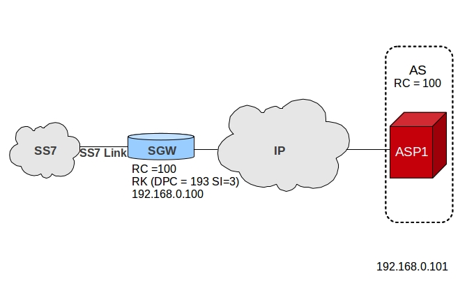
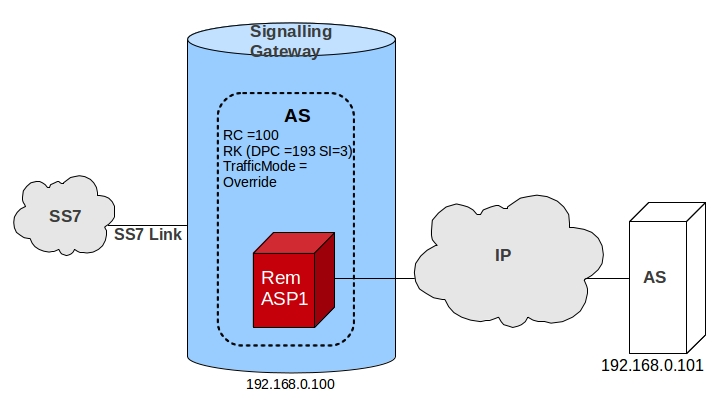
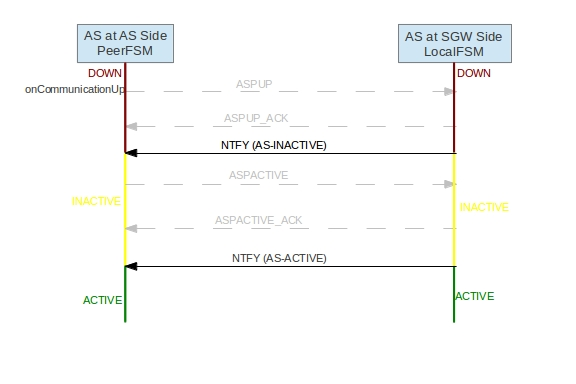

= M3UA

[[_mobicents_signaling_gateway_m3ua]]
== {this-platform}  Signaling Gateway M3UA Stack

`M3UA` is a client-server protocol supporting the transport of any SS7 MTP3-User signaling (e.g. `ISUP` and `SCCP` messages) over IP. `M3UA` is defined by the IETF SIGTRAN working group in RFC 4666.
 {this-platform}  M3UA Stack can be used on the Application Server side or on the Signaling Gateway side or can also be used in peer-to-peer mode IPSP.
 

`M3UA` uses the  {this-platform}  SCTP (Stream Control Transmission Protocol) Stack. 

.Note
[NOTE]
====
{this-platform} SCTP Stack uses Java SCTP layer which is only available from JDK 7 onwards. 
====

=== M3UA Load Balancing

Load Balancing can be configured by using the M3UA configuration parameter `useLsbForLinksetSelection` defined in the [path]_jboss-beans.xml_ file.
Refer to <<_configuring_rem_sgw>> for more details on configuring this.
 

Depending on the configuration (`useLsbForLinksetSelection` set to true or false), either the least significant bit or the most significant bit of SLS is used for load balancing between two Application Servers.
The remaining bits in the SLS are used for load balancing between ASPs within each AS.

[[_mobicents_signaling_gateway_m3ua_as]]
=== {this-platform}  M3UA Stack on the Application Server side

The figure below demonstrates the basic functionality of the {this-platform} M3UA Stack when configured as an Application Server (AS)  that will communicate with an External Signaling Gateway.
 

To use M3UA Stack as an AS, the Routing Context (RC) may not be known and is optional.
Refer to <<_configuring_rem_sgw>> for help in configuring M3UA Stack  as an AS. 

[[_mobicents_signaling_gateway_m3ua_sg]]
=== {this-platform}  M3UA Stack on the Signaling Gateway side

The figure below demonstrates the basic functionality of the {this-platform} M3UA Stack when configured as a Signaling Gateway (SG).  The {this-platform} Signaling Gateway provides the Nodal Interworking Function (NIF) that allows SS7 Signaling (SCCP/ISUP) to be inter-worked into the M3UA/IP Network.
 

{this-platform} M3UA Stack used on the SG side will share a common point code with a set of M3UA Application Servers.
You can configure the M3UA stack on SG side in one of the two traffic modes: Loadbalance or Override.
Broadcast traffic mode is not supported.
Refer to <<_configuring_sgw>> for instructions on configuring M3UA Stack as SG. {this-platform}  M3UA Stack used on SG side doesn't support routing key management messages.
The Routing Key should be provisioned statically using the management console. 

[[_mobicents_ipsp_m3ua]]
=== {this-platform}  M3UA Stack as IPSP

An IPSP is essentially the same as an ASP, except that it uses M3UA in a point-to-point fashion.
Conceptually, an IPSP does not use the services of a Signalling Gateway node. 

[[_m3ua_route]]
== Route

Before you can transfer Payload Data from M3UA-User to a peer, you must define the route based on Destination Point Code (DPC), Originating Point Code (OPC) and Service Indicator (SI). For details on how to add a new Route, please refer to <<_managing_add_m3ua_route>>.
 

While DPC is mandatory and should be an actual value, OPC and SI can be -1 indicating wild card.
The table below shows an example of a routeset table.
The routeset table contains routesets for all the possible destinations that can be reached.
This table is searched to find a match for the DPC:OPC:SI to be routed.
If a match is found in the list of Application Servers, an AS is chosen from the available routes associated with the routeset.
If an AS is not found, SI is substitued with -1 (DPC:OPC:-1) and a match is searched for again.
If a match still is not found, OPC is substituted with -1 (DPC:-1:-1) and the table is searched again for a match.
If there is still no matching AS, MSU is dropped and routing does not take place.
 

.Routesets
[cols="1,1,1,1", frame="all", options="header"]
|===
| DPC | OPC | SI | AS Name
| 2 | 3 | 2 | AS1, AS2
| 2 | 3 | -1 | AS1, AS2
| 4 | -1 | -1 | AS3
|===	

[[_m3ua_loadsharing]]
== Load Sharing

M3UA load-balancing makes use of the SLS field of the Protocol Data carried in the Payload Data Message.
M3UA can be configured as below: 

* load-balance between Application Servers (AS) for a given route.
  For any given route, there can be a maximum of 16 ASs defined. 
* load-balance within an AS and between Application Server Processes (ASP). A maximum 128 ASPs can be defined within an AS for load-sharing.	

For even distribution of messages in the network it is recommended that you define an even number of ASs for a route for load sharing.
You must ensure that you take proper care in deciding on a number of ASs for a route and number of ASPs within an AS depending on the routing label format of MSU. 

M3UA can be configured to use either the highest or lowest bits of the SLS for AS selection.
The number of SLS bits used for AS selection depends on the number of maximum AS defined for a route.
The remaining bits are used for ASP selection. 

.Routesets
[cols="1,1,1", frame="all", options="header"]
|===
| Max AS for Route | Number of SLS bits used for AS | Max ASPs that can be used within an AS
| 1 or 2 | 1 | 128
| 3 or 4 | 2 | 64
| 5 to 8 | 3 | 32
| 9 to 16 | 4 | 16
|===	

== M3UA Internal State Machine

{this-platform} M3UA Stack maintains finite state machine (FSM) for each ASP and AS.
Its important to understand these state's to troubleshoot the M3UA handshake messages exchanged

The FSM for ASP at AS side (or IPSPS client side) is referred to as LocalFSM and FSM for AS at AS side (or IPSP client side) is referred to as PeerFSM.
Similarly FSM for ASP at SGW side (or IPSP server side) is referred to as PeerFSM and FSM for AS at SGW side (or IPSP server side) is referred to as LocalFsm.
 

Figure below shows the various state of ASP at AS and SGW side.
In below example only Single Exchange of messages are considered for handshake mechanism  

.Restcomm M3UA Stack ASP state machine
image::images/M3UAStateASPSE.jpg[]

Figure below shows the various state of AS at AS and SGW side.
In below example only Single Exchange of messages are considered for handshake mechanism  

.Restcomm M3UA Stack AS state machine for AS - SGW

For IPSP, the ASP state machine remains same as AS-SGW, however for AS the state machine changes a bit as there is no exchange of Notify (NTFY) messages.
Figure below shows the various state of AS at IPSP Client and Server side.
In below example only Single Exchange of messages are considered for handshake mechanism  

.Restcomm M3UA Stack AS state machine for IPSP Client - Server
image::images/M3UAStateIPSPASPSE.jpg[]

In Double Exhcnage handshake mechanism both Local and Peer FSM exist in ASP and AS at each side.
Hence the number of handshake messages exchanged are twice that of Single Exchange.
 
