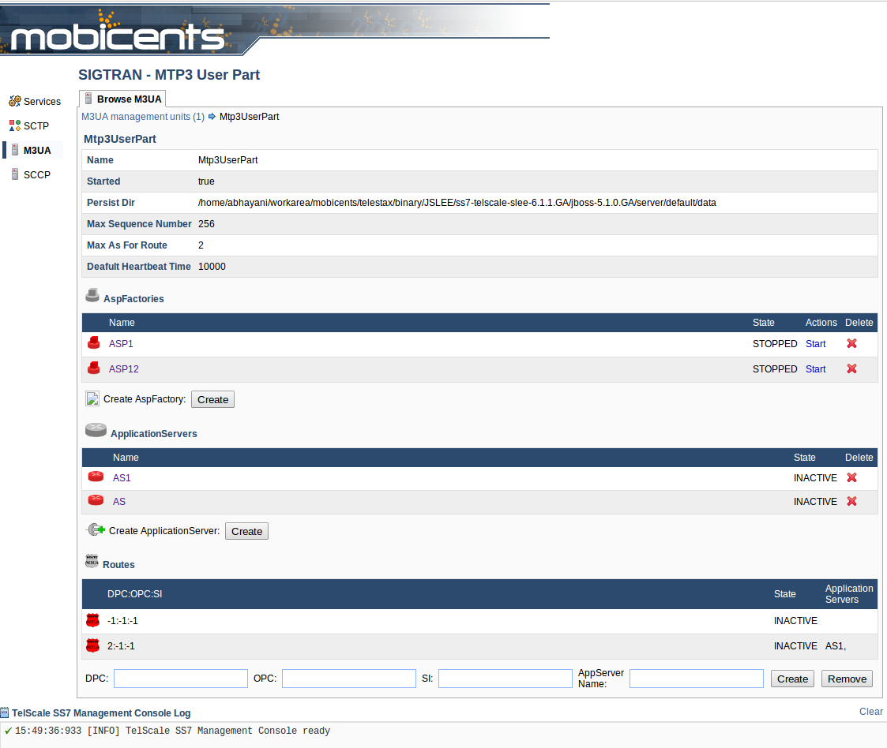

[[_mgmt_console]]
= Managing {this-platform} {this-application}  using GUI

[[_managing_sctp]]
== SCTP Management using GUI

[[_gui_sctp_server]]
=== Managing SCTP (or TCP) Servers using GUI

You can create, delete, start and stop SCTP Servers using the GUI.
In the middle section for Servers in the SCTP Management Unit window, you will find a list of all the Servers created.
Every correctly configured Server will be displayed in a row and for each Server, the first column will display the name of the Server.
The icon adjacent to the name will be lit 'green' if the server is currently running or if the server is stopped the icon will be 'red'. The second column will indicate the current state of the Server (Started / Stopped), the third column will allow you to Start / Stop the Server and the fourth column will allow you to delete the Server.

.Procedure: Create new SCTP Server (or TCP Server) instance
. In the middle section for Servers in the SCTP Management Unit window, click on the 'Create Server' button.
. In the 'Create Server' page, add details of the new Server.
  You must ensure that you fill in all the mandatory parameters (Name, Host Address, Host Port, Max Concurrent Connections). A detailed description of all the parameters is available in the Command Reference <<_shell_m3ua_sctp_server_create>>. 
. Verify the details entered and then click on the 'Save' button.
  A new SCTP Server (or TCP Server) will be created with parameters as specified.
  If there is an error in creating the Server then you will find the details of the error in the Management Console Log section below.
. You can click on the bread crumbs at the top to return to the SCTP Management page.
  You will find the newly created Server listed down in the 'Servers' section.

.Procedure: Delete SCTP Server (or TCP Server) instance
. Navigate to the 'Servers' section in the SCTP Management Unit window and locate the row corresponding to the Server you wish to delete.
. You must ensure that the Server is stopped prior to deletion.
  If the Server is stopped, the last column for 'Delete' will display a 'x' in red.
  If the Server is currently running, the 'x' will be displayed in grey.
  You can only delete the server if it is stopped and the 'x' is displayed in red.
. Click on the red 'x' to delete the corresponding Server instance.

.Procedure: Start or Stop a SCTP Server (or TCP Server) instance
. Navigate to the 'Servers' section in the SCTP Management Unit window and locate the row corresponding to the Server you wish to start / stop.
. Click on 'Start' in the actions column to start the corresponding Server instance.
  The SCTP Server will be started and the underlying SCTP server socket will be bound to the IP: Port configured for this Server instance at the time of creation. 
. If the Server has started successfully you will find the status indicating the Server as 'Started' and the icon will be green.
  If there is an error and the Server failed to start, you will find details of the error in the Management Console log below.
. To stop a Server currently running, click on 'Stop' in the actions column of the row corresponding to the Server instance.
  When the Server is stopped the underlying SCTP server socket will be closed and all resources are released.

[[_gui_sctp_association]]
=== Managing SCTP (or TCP) Associations using GUI

You can create and delete SCTP Associations using the GUI.
In the section for Associations in the SCTP Management Unit window, you will find a list of all the Associations created.
Every correctly configured Association will be displayed in a row and for each Server, the first column will display the name of the Association.
The icon adjacent to the name will be lit 'green' if the Association is currently running or if the Association is stopped the icon will be 'red'. The second column will indicate the current state of the Association (Started / Stopped) and the third column will allow you to delete the Association.

You cannot start or stop a SCTP Association here in this window.
Every SCTP Association must be associated with an ASP (M3UA) and will automatically start or stop when the associated ASP is started or stopped.
For more details on how to associate with an ASP, please refer to <<_managing_m3ua>>.

.Procedure: Create new SCTP (or TCP) Association (Client side or Server side) 
. In the section for Associations in the SCTP Management Unit window, click on the 'Create Association' button.
. In the 'Create Association' page, add details of the new Association.
  You must ensure that you fill in all the mandatory parameters: Name, Peer Address, Peer Port, Server Name (for Server side Association), Host Address and Host Port (for Client side Association). A detailed description of all the parameters is available in the Command Reference <<_shell_m3ua_sctp_association_create>>. 
. Verify the details entered and then click on the 'Save' button.
  A new SCTP Association will be created with parameters as specified.
  If there is an error in creating the Association then you will find the details of the error in the Management Console Log section below.
. You can click on the bread crumbs at the top to return to the SCTP Management page.
  You will find the newly created Association listed down in the 'Associations' section.

.Procedure: Delete SCTP Association (or TCP Association) instance
. Navigate to the 'Associations' section in the SCTP Management Unit window and locate the row corresponding to the Association you wish to delete.
. You must ensure that the Association is stopped prior to deletion.
  If the Association is stopped, the last column for 'Delete' will display a 'x' in red.
  If the Association is currently running, the 'x' will be displayed in grey.
  You can only delete the Association if it is stopped and the 'x' is displayed in red.
. Click on the red 'x' to delete the corresponding Association instance.

[[_managing_m3ua]]
== M3UA Management using GUI

If you click on the 'M3UA' link in the left panel, the main panel will display the details of all configured M3UA Management units as shown in the figure below.
Each configured unit will be displayed in a row and for each unit, the first column will display the name of the m3UA Management unit, the second column will display the current state of the unit (active or deactive). The name of the M3UA Management unit displayed here is fetched from the XML descriptor file [path]_jboss-beans.xml_ which is  located at [path]_$JBOSS_HOME/server/profile_name/deploy/restcomm-ss7-service/META-INF_, where  [app]`profile_name` is the server profile name. 

.GUI - M3UA Management
image::images/GUI_M3UA_Management.png[]

To manage a specific M3UA Management unit, click on the name of the unit in the first column.
The main panel will look similar to the figure below and is divided into four sections. 

The top section will display the properties of the chosen M3UA Management unit.
These values are also fetched from the XML descriptor file [path]_jboss-beans.xml_ and cannot be modified here in the GUI.
To modify these properties you must modifiy the [path]_jboss-beans.xml_ and restart the Server.
The GUI will now display the modified values.
 

The three sections below will allow you to manage and monitor all Application Server Processes, Application Servers and Routes within this M3UA Management unit.
 

.GUI - M3UA Management Unit

[[_gui_m3ua_asp]]
=== Managing M3UA Application Server Processes using GUI

You can create, delete, start and stop ASPs using the GUI.
In the section for ASPs in the M3UA Management Unit window, you will find a list of all the ASPs created.
Every correctly configured ASP will be displayed in a row and for each ASP, the first column will display the name of the ASP.
The icon adjacent to the name will be lit 'green' if the ASP is currently running or if the ASP is stopped the icon will be 'red'. The second column will indicate the current state of the ASP (Started / Stopped), the third column will allow you to Start / Stop the ASP and the fourth column will allow you to delete the ASP.

.Procedure: Create a new Application Server Process
. In the section for ASPs in the M3UA Management Unit window, click on the 'Create ASP' button.
. In the 'Create ASP' page, add details of the new ASP.
  You must ensure that you fill in all the mandatory parameters (Name, SCTP Association Name). A detailed description of all the parameters is available in the Command Reference <<_shell_m3ua_asp_side_create>>.
  You must ensure that a correctly configured SCTP Association is created and available prior to creating a new ASP.
  When the ASP is started or stopped, this corresponding SCTP Association will start / stop automatically. 
. Verify the details entered and then click on the 'Save' button.
  A new ASP will be created with parameters as specified.
  If there is an error in creating the ASP then you will find the details of the error in the Management Console Log section below.
. You can click on the bread crumbs at the top to return to the M3UA Management page.
  You will find the newly created ASP listed down in the 'ASPs' section.

.Procedure: Delete an Application Server Process
. Navigate to the 'ASPs' section in the M3UA Management Unit window and locate the row corresponding to the ASP you wish to delete.
. You must ensure that the ASP is stopped and unassigned from AS prior to deletion.
  If the ASP is stopped, the last column for 'Delete' will display a 'x' in red.
  If the ASP is currently running, the 'x' will be displayed in grey.
  You can only delete the ASP if it is stopped and the 'x' is displayed in red.
. Click on the red 'x' to delete the corresponding ASP.

.Procedure: Start or Stop an Application Server Process
. Navigate to the 'ASPs' section in the M3UA Management Unit window and locate the row corresponding to the ASP you wish to start / stop.
. Click on 'Start' in the actions column to start the corresponding ASP.
  You must ensure that the ASP is assigned to at least one AS prior to starting it. 
. If the ASP has started successfully you will find the status indicating the ASP as 'Started' and the icon will be green.
  If there is an error and the ASP failed to start, you will find details of the error in the Management Console log below.
. To stop an ASP currently running, click on 'Stop' in the actions column of the row corresponding to the ASP.

[[_gui_m3ua_as]]
=== Managing M3UA Application Servers using GUI

You can create and delete M3UA Application Servers and assign ASPs to an AS using the GUI.
In the section for Application Servers in the M3UA Management Unit window, you will find a list of all the Application Servers created.
Every correctly configured AS will be displayed in a row and for each AS, the first column will display the name of the AS.
The icon adjacent to the name will be lit 'green' if the AS is currently active or if the AS is inactive the icon will be 'red'. The second column will indicate the current state of the AS (Active / Inactive) and the third column will allow you to delete the AS.

.Procedure: Create a new M3UA Application Server 
. In the section for AS in the M3UA Management Unit window, click on the 'Create Application Server' button.
. In the 'Create Application Server' page, add details of the new AS.
  A detailed description of all the parameters is available in the Command Reference <<_shell_m3ua_as_side_create>>. 
. Verify the details entered and then click on the 'Save' button.
  A new AS will be created with parameters as specified.
  If there is an error in creating the AS then you will find the details of the error in the Management Console Log section below.
. You can click on the bread crumbs at the top to return to the M3UA Management page.
  You will find the newly created AS listed down in the 'Application Servers' section.

.Procedure: Delete a M3UA Application Server
. Navigate to the 'Application Servers' section in the M3UA Management Unit window and locate the row corresponding to the AS you wish to delete.
. You must ensure that all ASPs are unassigned from this AS and the current state of the AS is 'INACTIVE' prior to destroying the AS.
  If the AS is inactive, the last column for 'Delete' will display a 'x' in red.
  If the AS is currently active, the 'x' will be displayed in grey.
  You can only delete the AS if it is inactive and the 'x' is displayed in red.
. Click on the red 'x' to delete the corresponding AS.

.Procedure: Assign an ASP to an AS
. Navigate to the 'Application Servers' section in the M3UA Management Unit window, locate the row corresponding to the AS you wish to assign an ASP and click on the name of the AS.
. This will launch the AS details page where all the properties of the AS will be displayed.
  Scroll down to find the section "Select ASP to add to this AS:" and choose an ASP from the list.
  You can configure an ASP to process signaling traffic related to more than one AS, over a single SCTP Association.
  However you must ensure that all the Application Servers that share the ASP are configured with a valid Routing Context value.
. Click on the 'Add' button to add the selected ASP to this AS.
  The ASP will be assigned to this AS and will be displayed in the ASP list for this AS. 

.Procedure: Unassign an ASP from an AS
. Navigate to the 'Application Servers' section in the M3UA Management Unit window, locate the row corresponding to the AS you wish to unassign an ASP from and click on the name of the AS.
. This will launch the AS details page where all the properties of the AS will be displayed.
  Scroll down to find the section "Application Server Processes", listing all assigned ASPs.
  Locate the row corresponding to the ASP you wish to unassign from this AS.
. Click on the red coloured 'x' icon in the row corresponding to the ASP you wish to remove.
  This action will unassign the ASP from this AS.

[[_gui_m3ua_route]]
=== Managing M3UA Route using GUI

You can create and delete M3UA Routes using the GUI.
In the section for Routes in the M3UA Management Unit window, you will find a list of all the Routes created.
Every correctly configured Route will be displayed in a row and for each Route, the first column will display DPC, OPC, SI values.
The icon adjacent to the name will be lit 'green' if the Route is currently active or if the Route is inactive the icon will be 'red'. The second column will indicate the current state of the Route (Active / Inactive) and the third column will display the name of the AS assigned to route messages for this DPC.

NOTE: The maximum possible Application Servers you can configure for a Route is limited by the 'Max As For Route' parameter specified for this M3UA Management unit in the XML descriptor file [path]_jboss-beans.xml_ which is  located at [path]_$JBOSS_HOME/server/profile_name/deploy/restcomm-ss7-service/META-INF_, where  [app]`profile_name` is the server profile name.

.Procedure: Create a new M3UA Route 
. In the section for Routes in the M3UA Management Unit window, add values for DPC, OPC, SI and Application Server Name.
  A detailed description of all the parameters is available in the Command Reference <<_shell_m3ua_as_side_route_add>>. 
. Verify the details entered and then click on the 'Create' button.
  A new Route will be configured with parameters as specified.
  If there is an error in creating the Route then you will find the details of the error in the Management Console Log section below.

.Procedure: Delete a M3UA Route
. Navigate to the 'Routes' section in the M3UA Management Unit window.
. Enter values for DPC, OPC, SI and Application Server Name.
. Click on the 'Remove' button to delete the Route corresponding to the parameters specified.
