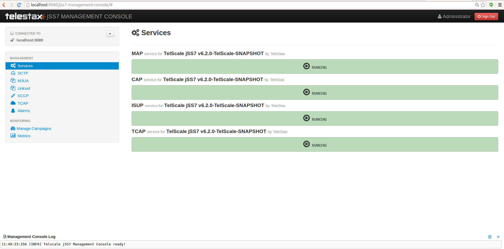
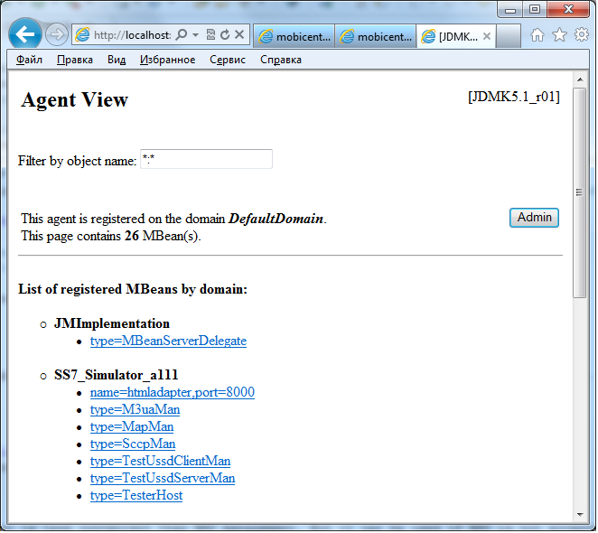
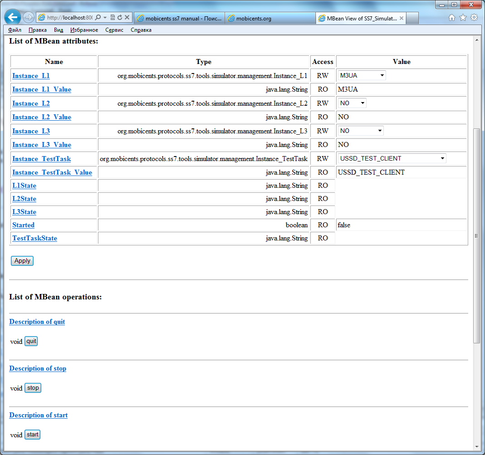

[[_running_jss7]]
= Running

You must ensure that you follow the steps outlined in the {this-platform} {this-application} Installation Guide to install the Components.
As explained in the Installation Guide, you may install  {this-application} as a standalone library or as a JBoss AS SS7 Service or as a Signaling Gateway.
Once installed, you can run the different Components as described in the sections below. 

[[_running_ss7_service]]
== Running {this-platform}  SS7 Service

.Procedure: Start SS7 Service
. Pre-requisite: You must have SS7 Service deployed in the JBoss Application Server as explained in the Installation Guide.
. All you have to do to start the Service is start the JBoss AS.
  This will automatically start the SS7 Service.
  To start the JBoss Server you must execute the [path]_run.sh_ (Unix) or [path]_run.bat_ (Microsoft Windows) startup script in the [path]_<jboss_install_directory>/bin_ folder (on Unix or Windows).  
. Result: If the service started properly you should see following lines in the Unix terminal or Command Prompt depending on your environment: 
+
----
14:07:47,580 INFO  [TomcatDeployment] deploy, ctxPath=/admin-console
14:07:47,650 INFO  [config] Initializing Mojarra (1.2_12-b01-FCS) for context '/admin-console'
14:07:49,980 INFO  [TomcatDeployment] deploy, ctxPath=/
14:07:50,032 INFO  [TomcatDeployment] deploy, ctxPath=/jmx-console
14:07:50,235 INFO  [ManagementImpl] SCTP configuration file path /home/vinu/jboss-5.1.0.GA/server/default/data/SCTPManagement_sctp.xml
14:07:50,262 INFO  [ManagementImpl] Started SCTP Management=SCTPManagement WorkerThreads=0 SingleThread=true
14:07:50,269 INFO  [SelectorThread] SelectorThread for Management=SCTPManagement started.
14:07:50,422 INFO  [M3UAManagement] M3UA configuration file path /home/vinu/jboss-5.1.0.GA/server/default/data/Mtp3UserPart_m3ua.xml
14:07:50,512 INFO  [M3UAManagement] Started M3UAManagement
14:07:50,605 INFO  [SccpStackImpl-SccpStack] Starting ...
14:07:50,665 INFO  [Router] SCCP Router configuration file path /home/vinu/jboss-5.1.0.GA/server/default/data/SccpStack_sccprouter.xml
14:07:50,667 INFO  [Router] Started SCCP Router
14:07:50,668 INFO  [SccpResource] SCCP Resource configuration file path /home/vinu/jboss-5.1.0.GA/server/default/data/SccpStack_sccpresource.xml
14:07:50,669 INFO  [SccpResource] Started Sccp Resource
14:07:50,671 INFO  [SccpStackImpl-SccpStack] Starting routing engine...
14:07:50,671 INFO  [SccpStackImpl-SccpStack] Starting management ...
14:07:50,671 INFO  [SccpStackImpl-SccpStack] Starting MSU handler...
14:07:50,696 INFO  [ShellExecutor] Starting SS7 management shell environment
14:07:50,714 INFO  [ShellExecutor] ShellExecutor listening at /127.0.0.1:3435
14:07:50,776 INFO  [TCAPStackImpl] Starting ...org.mobicents.protocols.ss7.tcap.TCAPProviderImpl@14d18a1
14:07:50,776 INFO  [TCAPProviderImpl] Starting TCAP Provider
14:07:50,776 INFO  [TCAPProviderImpl] Registered SCCP listener with address 8
14:07:51,012 INFO  [SS7Service]  [[[[[[[[[ Mobicents jSS7 3.0.0 service started ]]]]]]]]] 
14:07:51,156 INFO  [Http11Protocol] Starting Coyote HTTP/1.1 on http-127.0.0.1-8080
14:07:51,177 INFO  [AjpProtocol] Starting Coyote AJP/1.3 on ajp-127.0.0.1-8009
14:07:51,184 INFO  [ServerImpl] JBoss (Microcontainer) [5.1.0.GA (build: SVNTag=JBoss_5_1_0_GA date=200905221053)] Started in 40s:691ms
----		 
. If you are starting {this-platform}-{this-application}-{project-version} for the first time, SS7 is not configured.
  You need to use the Shell Client to connect to {this-platform}-{this-application}-{project-version} .
  Using CLI you can configure how service interacts with SS7 network, that is you configure either installed SS7 card and its native library , or `M3UA` layer.
  You can also use the GUI to achieve the same.
  Once configured, the state and configuration of SS7 is persisted which stands server re-start.

.Procedure: Stop SS7 Service
. To stop the SS7 service, you must shut down the JBoss Application Server.
  To shut down the server(s) you must execute the `shutdown.sh -s` (Unix) or  `shutdown.bat -s` (Microsoft Windows) script in the [path]_<jboss_install_directory>/bin_  directory (on Unix or Windows).
. If the Service stopped properly, you will see the following three lines as the  last output in the Unix terminal or Command Prompt: 
+
----
[Server] Shutdown complete
Halting VM
----

[[_running_sgw_binary]]
== Running {this-platform}  Signaling Gateway

[[_starting_sgw_binary]]
=== Start the Gateway

.Procedure: Start the {this-platform}  Signaling Gateway on 
. Change the working directory to the installation directory (the one into which the zip file's contents was extracted to) 
+
[subs="attributes"]
----
downloads]$ cd {this-folder}-jss7-<version>/ss7/{this-folder}-ss7-sgw
----

. (Optional) Ensure that the [path]_bin/run.sh_							start script is executable. 
+
[subs="attributes"]
----
{this-folder}-ss7-sgw$ chmod +x bin/run.sh
----

. Execute the [path]_run.sh_							Bourne shell script. 
+
[subs="attributes"]
----
{this-folder}-ss7-sgw$ ./bin/run.sh
----

. In the Linux terminal, the {this-platform} Signaling Gateway has started successfully if the last line of output is similar to the following 
+
[source]
----
15:51:18,247 INFO  [MainDeployer] [[[[[[[[[ Mobicents Signaling Gateway: release.version= Started ]]]]]]]]]
----

.Procedure: Start the {this-platform}  Signaling Gateway on 
. Using Windows Explorer, navigate to the [path]_{this-folder}-jss7-<version>/ss7/{this-folder}-ss7-sgw/bin_ subfolder in the installation directory. 
. The preferred way to start the {this-platform} Signaling Gateway is from the Command Prompt.
  The command line interface displays details of the startup process, including any problems encountered during the startup process. 
+
Open the Command Prompt via the [label]#Start# menu and navigate to the correct folder: 
+
[subs="attributes"]
----
C:\Users\<user>\My	Downloads>cd "{this-folder}-jss7-<version>\ss7\{this-folder}-ss7-sgw"
----

. Start the Gateway by executing the [path]_run.bat_ file: 
+
* [path]_run.bat_ batch file: 
+
----
C:\Users\<user>\My Downloads\mms-standalone<version>>bin\run.bat
----

[[_sgw_stopping]]
=== Stop the Gateway

The only option to stop the gateway is by pressing `Ctrl c`  and bringing down the JVM or killing the process. 

[[_sgw_running_alter]]
=== Bind the Gateway to IP 

Using `run.sh` without any arguments binds the gateway to `127.0.0.1`.
To bind the Gateway to a different IP, pass the IP address as value to the `-b` command line option.
For example to bind the server to `115.252.103.220` you will use the command as below: 

[subs="attributes"]
----
{this-folder}-ss7-sgw$ ./bin/run.sh -b 115.252.103.220
----

[[_running_standalone]]
== Running {this-application}  as a Standalone library

If you do not wish to use the JBoss Container and do not require JSLEE RAs you can configure and run the Stack as a Standalone library.
For more details, refer to <<_configuring_standalone>>

[[_running_shell]]
== Running the Shell`Shell`

[[_shell_start]]
=== Start the Shell Client

Shell client can be started with following command from [path]_$JBOSS_HOME/bin_			: 

[source]
----
[$] ./ss7-cli.sh
----

Once console starts, it will print following like information:

----

version=6.2.8.493,name={this-platform} CLI,prefix={this-folder},vendor=TeleStax
{this-folder}>
----

The `ss7-cli`			script supports the following options 

----

Usage: SS7 [OPTIONS]
Valid Options
-v           Display version number and exit
-h           This help screen
----

[[_connect_shell]]
=== Connect to Managed Instance

Shell needs to connect to managed instance.
Command to connect has following structure:

[source]
----

connect <IP> <PORT>
----

.Connect to remote machine
====
----

mobicents>connect 10.65.208.215 3435

mobicents(10.65.208.215:3435)>
----
====

NOTE: Host IP and port are optional, if not specified, shell will try to connect to `127.0.0.1:3435`			

[[_disconnect_shell]]
=== Disconnect

Command to disconnect has following structure:

[source]
----
ss7 discconnect
----

.Disconnect
====
----

mobicents(10.65.208.215:3435)>ss7 disconnect

Bye
mobicents>
----
====

[[_cli_security]]
=== Authentication and Audit Logs

==== Security

Security is a fundamental requirement of any Telecom application.
You must control access to your SS7 network and restrict who is allowed to access what and perform what operations.
 

{this-platform} {this-application} CLI Security is based on the JBoss Security Framework.
The JBoss Security framework provides support for a role-based declarative security model as well as integration of custom security via a security proxy layer.
The default implementation of the declarative security model is based on Java Authentication and Authorization Service (JAAS) login modules and subjects.
 

.Procedure: Enable Security
. Add a new parameter named "`securityDomain`" to the "ShellExecutor" bean in the configuration file [path]_jboss-5.1.0.GA/server/default/deploy/{this-folder}-ss7-service/META-INF/jboss-beans.xml_ and save the changes. 
+
----

<property name="securityDomain">java:/jaas/jmx-console</property>
----					
. Configure the security domain in the file [path]_jboss-5.1.0.GA/server/default/conf/login-config.xml_ following the instructions in the JBoss Admin Guide. 
. Create entries for user id and password in the file [path]_ jboss-5.1.0.GA/server/default/conf/props/jmx-console-users.properties_ for every user allowed to access the CLI.	 

.Procedure: Disable Security
. Delete all configurations created as mentioned above and remove the parameter "`securityDomain`" from the "Shell Executor" bean defined in [path]_jboss-5.1.0.GA/server/default/deploy/{this-folder}-ss7-service/META-INF/jboss-beans.xml_.			 

If you would like to read more about the JBoss Security Framework, please refer to the JBoss Admin Guide available in their website. 

[[_audit]]
==== Audit Configuration

If security is enabled then you can log the operations performed by every user.
 

.Procedure: Enable Audit
. Add a new appender to the file [path]_jboss-5.1.0.GA/server/default/conf/jboss-log4j.xml_ as below:  
+
----

<appender name="AUDIT" class="org.jboss.logging.appender.DailyRollingFileAppender">
	<errorHandler class="org.jboss.logging.util.OnlyOnceErrorHandler"/>
	<param name="File" value="${jboss.server.log.dir}/audit.log"/>
	<param name="Append" value="true"/>
	<param name="DatePattern" value="'.'yyyy-MM-dd"/>
	<layout class="org.apache.log4j.PatternLayout">
		<param name="ConversionPattern" value="%d %-5p [%c] (%t:%x) %m%n"/>
	</layout>
</appender>
----	 
. Add a new category to the file [path]_jboss-5.1.0.GA/server/default/conf/jboss-log4j.xml_ as below:  
+
----

<category name="org.jboss.security.audit.providers.LogAuditProvider" additivity="false">
	<priority value="TRACE"/>
	<appender-ref ref="AUDIT"/>
</category>
----	 			

When security and audit is enabled, a sample audit log looks like this: 
----

2012-11-28 22:17:27,005 TRACE [org.jboss.security.audit.providers.LogAuditProvider] (pool-19-thread-8:) [Success]message=login success;principal=admin;
2012-11-28 22:17:47,659 TRACE [org.jboss.security.audit.providers.LogAuditProvider] (pool-19-thread-1:) [Info]response=Successfully added client Association=SCTPAssoc1;principal=admin;command=sctp association create SCTPAssoc1 CLIENT 127.0.0.1 2775 127.0.0.1 2776;
2012-11-28 22:18:06,773 TRACE [org.jboss.security.audit.providers.LogAuditProvider] (pool-19-thread-3:) [Success]message=logout success;principal=admin;
----	 

[[_commands_help]]
=== Command-line Completion

{this-platform} {this-application} Shell supports Command-line completion (Tab Completion) allowing you to type the first (or first few) character(s) of the comand and press tab to fill in the rest of the command.
As soon as you enter the CLI (by executing the [path]_ss7-cli.sh_ script) you can make use of this feature to view all possible commands.
 

When you first enter CLI and press the "tab" key, CLI will display all operations permitted in that context.
Once you connect to a managed instance and while staying connected if you press the "tab" key it will display all other commands allowed. 

[source]
----

mobicents> [tab key press]
history  connect  exit     
mobicents>connect 10.65.208.215 3435
mobicents(10.65.208.215:3435)> [tab key press]
sctp        linkset     m3ua        sccp        history     disconnect
----

If you enter the first few characters of a command and press "tab", CLI will automatically fill in the rest of the command or display all possible commands if there is more than one command beginning with the characters entered by you. 

[source]
----

mobicents(10.65.208.215:3435)>sctp [tab key press]
server       association  --help       
mobicents(10.65.208.215:3435)>sctp
----

In addition, help files are also available for every command using the --help option.
The help files provide details of the command including possible parameters and examples of usage if applicable.
 

[source]
----

mobicents(10.65.208.215:3435)>sctp --help
Name
	sctp
	Manage M3UA - SCTP

SYNOPSIS
	sctp server [create | destroy | start | stop | show]  [parameters]

	sctp association [create | destroy | show]  [parameters]
         
	parameters 
		Command Line parameters.

DESCRIPTION
	This command is used to manage M3UA - SCTP. You can create, destroy, start and 
	stop a SCTP Server and view the Server configuration using the sctp server 
	command. You can create, destroy and view SCTP Associations using the 
	sctp association command.

SEE ALSO
	sctp server create, sctp server destroy, sctp server start, sctp server stop, 
	sctp server show, sctp association create, sctp association destroy,
	sctp association show

mobicents(10.65.208.215:3435)>
----

[[_using_gui]]
== Running the Graphical User Interface

Open a Web Browser and navigate to http://localhost:8080/jss7-management-console/. The window will look similar to the figure below.
The GUI is divided into three sections:  

* A left panel listing the management units (Services, SCTP, M3UA, Linkset, SCCP, TCAP, Alarms, Manage Campaigns and Metrics). You can click on any of these to select and navigate to the specific management unit.
* A main panel displaying the currently selected management unit.
  At the top of this panel you will find a bread crumb trail providing links back to each previous page that you navigated through in order to get to the current page.
  The main view is categorized into multiple tabs to manage different aspects of the selected layer.
* A bottom panel displaying the log data.
  You can clear the log anytime by clicking on the trash icon at the top right corner of this panel.
  You can also minimize or maximize this panel to suit your needs.

.GUI - Services
		

The main window will display all the configured services and their current state (running or stopped). In the example above MAP, CAP, TCAP and ISUP are configured and running.
If any of these services is not running currently, the page will indicate that service as 'Stopped'. This page only indicates the current state of a service and does not allow you to start or stop the service dynamically.
You can view this screen anytime by clicking on the 'Services' link in the left panel. 

NOTE: You will notice bread crumbs at the top of the main panel, allowing you to return to any of the previous pages you navigated through.

[[_connect_gui]]
=== Connect to a new Instance

You can connect to a new instance by entering the IP:Port values and the login credentials in the top left corner of the GUI.
However please note that this feature is not available in this release but will be fully functional in the next release.
 

[[_gui_security]]
=== Authentication

{this-platform} {this-application} GUI Management Security is based on the JBoss Security Framework.
This is explained in <<_security>>. 

[[_running_ss7_simulator]]
== Running {this-platform} {this-application}  Simulator

The {this-platform} {this-application} comes with a Simulator module that will enable you to test and understand the functionality of the Stack.
You can install and run the Simulator module on any machine.
In addition, you can run several instances of the Simulator from one folder and each of these instances can have it's own configuration options.
Configuration options are saved into a xml configuration file. 

Each running instance of the Simulator has its own name (called "host name") and the name of configuration file depends on this "host name". For example if the host name is "a1", then the name of the configuration file will be "a1_simulator.xml". You must ensure that you provide each running Simulator instance with a unique host name in order to allow each running Simulator instance to have different configuration options.
 

You can run and manage the Simulator locally or remotely.
For running the Simulator locally you will be using a GUI interface.
If you are intending to run the Simulator remotely, then you can do so using RMI access (via a GUI interface) or a HTML interface (using a HTML Browser). 

[[_simulator_configuring_locally]]
=== Running the Simulator Locally

.Procedure: Launching the Simulator Locally
. Pre-requisite: You must have SS7 Simulator installed locally in the machine.
. Change the working directory to the bin folder in the Simulator's installation directory. 
+
[subs="attributes"]
----
downloads]$ cd {this-folder}-jss7-<version>/ss7/{this-folder}-ss7-simulator/bin
----

. (Optional) Ensure that the [path]_run.sh_							start script is executable. 
+
----
bin$ chmod +x run.sh
----

. Execute the [path]_run.sh_							Bourne shell script with the command `./run.sh gui`.
  If you wish to pass the "host name" parameter (say for example "a1") you can do so by issuing the command as `./run.sh gui -na1` or `./run.sh gui --name=a1` where "a1" is the "host name" of this simulator instance.
+
----
bin$ ./run.sh gui --name=a1
----

. Result: This will launch the GUI application form ""Connecting to a testerHost ..." as in the figure below:  
+
.Running Simulator Locally
image::images/Simulator-Example1.png[]				

.Procedure: Creating a Local testerHost
. Pre-requisite: You must have the GUI application form "Connecting to a testerHost" launched by running the simulator locally as explained in the above procedure.
. In the GUI application form "Connecting to a testerHost ..." enter a value for the Host name field if it is empty.
. Select the option "Create a local testerHost" and press the "Start" button.
. Result: This will create a local testerHost and launch a new form "SS7 Simulator: <host name>-local" as in the figure below: 
+
.The main form of the Simulator
image::images/Simulator-Example2.png[]

.Procedure: Running a Test
. Pre-requisite: You must have the main Simulator form launched as explained in the above procedure.
. Select required modules for Layers 1 - 3 and the Testing Task.
. Configure the modules to meet your requirements.
  Click on the button "..." to the right of the selected module.
  When layer configuring you can press one of two buttons "Load default values for side A" and "Load default values for side B" for loading default values for testing.
  These default values can be used if you are using SS7 Simulators in the one computer host as the side A and the side B for interaction.
  To save the configured layers to the disk, click the "Save" button.
  To reload the saved configuration, use the "Reload" button.
. When all required layers are correctly configured, click the "Run test" button.
. Result: The form for testing will be displayed as in the figure below: 
+
.Example Simulator testing form
image::images/Simulator-Example3.png[]

The form has three sections:  

* The top section displays information regarding the Simulator layers and the state of Testing.
  This information is refreshed every 5 seconds automatically.
  You can also choose to refresh this manually by clicking the "Refresh state" button.
  When you click the "Start" button, all modules will start and be ready for testing.
  When you click the "Stop" button all modules will stop.
* The middle section of the form displays notifications from testing modules.
* The bottom section of the form holds test dependant information whose details are displayed in the corresponding test definition. 

For more details on executing tests, please refer to <<_simulator_tests>>.

[[_simulator_configuring_remotely]]
=== Running SS7 Simulator remotely 

The Simulator can be run remotely using RMI and/or HTML Adaptors.
But prior to launching the Simulator remotely, you must first run a tester host in the host machine as explained in the procedure below:  

.Procedure: Launching a Tester Host in the host machine
. Pre-requisite: You must have SS7 Simulator installed locally in the host machine.
. Change the working directory to the bin folder in the Simulator's installation directory. 
+
[subs="attributes"]
----
downloads]$ cd {this-folder}-jss7-<version>/ss7/{this-folder}-ss7-simulator/bin
----

. (Optional) Ensure that the [path]_run.sh_ start script is executable. 
+
----
bin$ chmod +x run.sh
----

. Execute the [path]_run.sh_ Bourne shell script with the command `./run.sh core -na1 -t8001 -r9999,9998` or `./run.sh core --name=a1 --http=8001 --rmi=9999,9998`.
You can use a `rmi` connector or `http` connector or both simultaneously.
The command options are explained below: 

* "-n" (or "--name=") defines a host name (in the example above: "a1").
* "-r" (or "--rmi=") defines a port's listening for rmi requests (in the example above: "9999 and 9998"). RMI protocol uses 2 ports for server access.
  The first port (9999 above) is rmi port and 9998  is second port used by RMI.
  Usually RMI randomly selects this 2nd port, however if the core simulator is behind firewall,  the GUI will not be able to connect from remote machine without admin opening up all the ports.
  This can be risky, hence --rmi takes two ports as comma separated and admin can open these two ports on firewall.
+
NOTE: Please note that fixing the 2nd port in RMI contradicts the RMI specification. 

* "-t" (or "--http=") defines a port listening for html requests (in the example above: "8001").
* "-Djava.rmi.server.hostname=192.168.1.1" - if remote host contains several IP addresses you need to specify by this command which exactly IP address RMI will use.
+
----
bin$ ./run.sh core -na1 -t8001 -r9999,9998
----							
+
or 
+
----
bin$ ./run.sh core --name=a1 --http=8001 --rmi=9999,9998
----						
. Result: This will start the Tester Host in this machine and the output displayed in the console will be as below: 
+
----

=========================================================================

  SS7 Simulator Bootstrap Environment

  SIMULATOR_HOME: /home/vinu/restcomm-jss7-6.1.3.GA/ss7/restcomm-ss7-simulator

  JAVA: /usr/lib/jvm/jre-1.7.0-openjdk/bin/java

  JAVA_OPTS: -Dprogram.name=run.sh  -Djava.net.preferIPv4Stack=true -Xms256m -Xmx512m -Dsun.rmi.dgc.client.gcInterval=3600000 -Dsun.rmi.dgc.server.gcInterval=3600000

  CLASSPATH: /home/vinu/restcomm-jss7-6.1.3.GA/ss7/restcomm-ss7-simulator/bin/run.jar

=========================================================================
.
.
.
.
.
All beans have been loaded...
RMI connector initializing...
RMI connector has been started...
Html connector initializing...
Html connector has been started...
Waiting for commands...
----				

When the Tester Host is running successfully in the host machine, you can now run the Simulator tests remotely from any machine which has the Simulator installed.
The following procedures provide instructions to run the Simulator remotely using the two interfaces (RMI and HTML).

.Procedure: Managing the Simulator Remotely using RMI Interface
. Pre-Requisite: The Tester Host must be launched in the host machine as explained in the above procedure.
  The local machine must have the Simulator installed.
. The best client for managing the Simulator via a RMI interface is the GUI interface of Simulator.
It can be launched in the same way as launching a Simulator locally:  
+
----

		./run.sh gui
----
+
This will launch the GUI form "Connecting to a testerHost...". 
+
.Launching Simulator GUI for a remote mode
image::images/Simulator-Example4.png[]		

. In the form, select the option "Connect to the existing testerHost via JMX".
. In the default RMI connection string, replace "localhost" with the correct IP address of the tester host computer and the value "9999" with the correct RMI port (the port from option "-r" or "--rmi=" as provided when launching the testerHost in the host machine). 
. Once successfully connected, the management will be similar to the procedures explained for running the Simulator application locally (see <<_simulator_configuring_locally>>). "Jconsole" application can be also used as the client.
  But this application is less convenient when compared to the easy RMI interface.

.Procedure: Managing the Simulator Remotely using HTML Interface
. HTML management is less convenient than RMI management.
But it can be used if RMI is not acceptable (for example if you are behind a proxy). For configuring the parameters and running the tests you can use any HTML browser.
In the URL field of the browser, type "http://<IP address>:<port>" where IP address is the host machine's address and port is the value specified for "-t" or "--http=" option when launching the Tester Host in the remote machine. 
+
.Managing remotely with a HTML Interface

. The web page will display all Beans.
"TesterHost" is the main MBean in which you can select the mode for test working, start/stop testing (buttons "Start"/"Stop") and quit a tester host (button "quit"). You can use other Beans for setting different options for layers and test tasks.
+
.TesterHost Bean
	

. The Results of the tests can be found at the console (in the server) or in the log file (file name is "a1.log" where "a1" is the name of the Simulator instance).     

[[_running_ss7_cards]]
== Running with SS7 cards

Apart from the simulator a {this-platform} USSD Demo SLEE Application has been tested with Dialogic's MAP Test Utility (MTU) tool in a process that is described below.
 +
It is assumed that you have two Servers (each fitted with Dialogic card) connected to each other via cross cable and the OS is Linux-based. To understand how to set-up the environment for Dialogic card please download respective Programmers Manual. This test was carried out on https://www.dialogic.com/~/media/manuals/ss7/cd/ProductSpecific/SPCI-CPM8/ProgrammersManual/SPCI-PM.pdf[Dialogic SPCI2S cards]. It is recommened to read the http://resource.dialogic.com/telecom/support/ss7/cd/GenericInfo/GeneralDocumentation/U30SSS03-MTU-MTR-UG.pdf[MTU/MTR guide] before proceeding further. 

=== MTU setup

Please download the http://www.dialogic.com/support/helpweb/helpweb.aspx/1580/ussd_map_sample_code/Signaling_SS7[modified MTU code for USSD] and build it to create the executable. 
 
:configtxt: http://www.dialogic.com/den/cfs-file.ashx/__key/CommunityServer.Discussions.Components.Files/10/0654.config.txt
:systemtxt: http://www.dialogic.com/den/cfs-file.ashx/__key/CommunityServer.Discussions.Components.Files/10/0121.system.txt

Rename {configtxt}[this file] to config.txt and {systemtxt}[this file] to system.txt and place them at /opt/dpklnx/ before loading the driver and activating links. Its is assumed that MTP2/MTP3 is loaded onboard and Dialogic SCCP, TCAP, MAP and MTU is loaded on host system.
 +
Command at /opt/dpklnx/ to load drivers
[source,bash]
----
/opt/dpklnx# ./gctload -d
----

Command at /opt/dpklnx/ to activate link
[source,bash]
----
/opt/dpklnx# ./mtpsl act 0 0
----

Once the link is activated, don't forget to execute the mtucfg.ms7 script. This script registers the MTU with Dialogic SCCP stack.
[source,bash]
----
./s7_play -f/home/abhayani/workarea/mobicents/dialogic/upd_tar_FILES/RUN/MTU/SCRIPTS/mtucfg.ms7
----

=== USSD Application Setup

Download the configuration and system files for {this-platform} USSD from https://developer.jboss.org/wiki/USSDMAPTestingWithDialogicBoards[here] and rename them to config.txt and system.txt respectively and place it to corect folder (/opt/dpklnx/ for linux) before loading the driver and activating links. Use same commands as shown above to load drivers and activate link. It is assumed here that MTP2/MTP3 is loaded onboard. The Mobicents Dialogic native driver (libmobicents-dialogic-linux.so) communicates with MTP3 onboard.
 +
Once link is active start the {this-platform} JAIN SLEE (JBoss Application) Server. Remember before starting application server, place the native file in correct folder (for example incase of 32bit linux mobicents-jainslee-2.4.0.CR1-jboss-5.1.0.GA/jboss-5.1.0.GA/bin/META-INF/lib/linux2/x86/libmobicents-dialogic-linux.so) or the java.library.path should be set to point the directory containing native component.
 +
Deploy the {this-platform} SS7 Service as explained in Mobicents SS7 Docs.
Deploy the {this-platform} MAP RA as explained in Mobicents JSLEE Docs. Use the following as map-default-ra.properties.
[source,bash]
----
sccp.service=java:/mobicents/ss7/sccp
sccp.pointcode=0
sccp.ssn=8
----
Deploy your demo
 +
One last step before the application can be tested is configuring the Linkset and SCCP rule. Fire the CLI and connect to {this-platform} SS7 Service as explained in {this-platform} SS7 Doc. Following configuration is to be done only once and it survives system restarts.
 +
Execute bellow command to register routing rule based on DPC + SSN
[source,bash]
----
mobicents(127.0.0.1:3435)>sccprule create Rule4 dpc 1 ssn 8 mtpinfo name name1 opc 2 apc 1 sls 16
----

Execute bellow command to register dialogic linkset
[source,bash]
----
mobicents(127.0.0.1:3435)>linkset create dialogic opc 2 apc 1 ni 3 srcmod 61 destmod 34 linkset1
----

Execute bellow command to activate linkset
[source,bash]
----
mobicents(10.65.208.215)>linkset activate linkset1
----

=== Test

Execute the following MTU command from MTU machine
[source,bash]
----
ussdtest -d6 -g43010008 -a43020008 -i987654321 -s"1" -U*88#
----

You should see the [INFO] messages in the Mobicents JAIN SLEE Server console about received USSD short codes and response sent.
 
The /opt/dpklnx in both machines will have mtp.pcap and mtp.txt showing the USSD messages exchanged.

