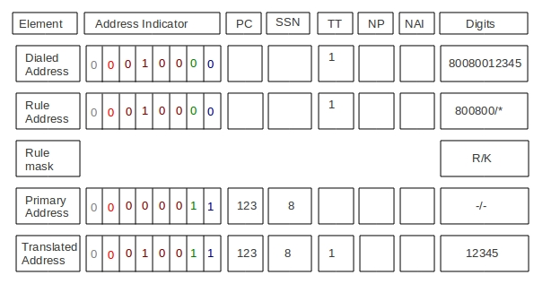
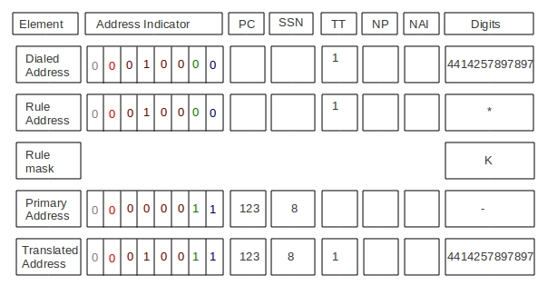

= SCCP

The Signaling Connection Control Part (SCCP) is defined in ITU-T Recommendations Q.711-Q.716.
SCCP sits on top of Message Transfer Part 3 (MTP3) in the SS7 protocol stack.
The SCCP provides additional network layer functions to provide transfer of noncircuit-related (NCR) signaling information,  application management procedures and alternative, more flexible methods of routing.
 

[[_sccp_routing]]
== Routing Management

SCCP provides a routing function that allows signaling messages to be routed to a signaling point based on dialed digits,  for example.
This capability is known as Global Title Translation (GTT), which translates what is known as a global title  (for example, dialed digits for a toll free number) into a signaling point code and a subsystem number so that it can be processed  at the correct application. 

[[_sccp_gtt_configure]]
=== GTT Configuration

GTT is performed in two stages.
First is matching the rule and second is actual translation.

For matching the rule, the called party address global title digits are matched with <digits> configured while defining the Rule.
Once the digits match actual  translation is done.
Also for rule matching GT Indicator, translation type, numbering plan and nature-of-address of a rule and of message called party address must be equal. 

Matching rule::
  As explained previously, the  <digits> can be divided into sections using the "/" separate character.
  Each section defines set of  digits to be matched.
  Wild card * can be used to match any digits and ? can be used to match exatcly one digit.
  For example Rule is to match starting 4 digits (should be 1234) and doesn't care for rest; the <digits> in the command will be 1234/*. If the Rule is such that starting 3 digits should be 123, doesn't care for other three digits but last two digits should be 78; the <digits> in the command will be 123/???/78. If digit to digit matching is needed the the <digits> in the command will be exact digits to be matched without sections.

Translation::
Resulting Called Party Address will contain: 

* PC in the generated CalledPartyAddress is taken from primary/backup address.
  This PC will not be encoded into a message if the following option is set: sccp set removespc true.
* SSN will be taken from primary/backup address.
  If it is absent there - will be taken from an original message address.
  If also absent - SSN will not be included.
* GT type (0001, 0010, 0011, 0100) is taken from from AI (AddressIndicator) of primary/backup address.
  If AI of primary/backup address contains "no GT" (or bad value) but after address translating we need GT - it will be taken from AI of an original message address.
* NAI, TT, NP (and Encoding schema) is taken from GT of primary/backup address.
  If no GT in primary/backup address but after address translating we need GT - it will be taken from GT of an original message address.
* Digits for CalledPartyAddress will be generated in following way.
  For translation each section in <mask> defined while creating the Rule, defines how replacement operation is performed.
  If  <mask> defines K (KEEP), the originally dialed digits are kept and if <mask> defines R (REPLACE) the digits from primary address or back address are used.
  The primary/backup address  should always define the point code and the translated address will always have this point code.
  If the primary/backup address defines the subsystem number the translated address will also have this subsystem number.
  The address-indicator  of translated address is always from primary/backup address.
    See below examples                         

. Example 1 : Remove the Global Title and add PC and SSN
+
.GTT - Example 1
image::images/GTT-Example1.jpg[]

. Example 2 : Partial Match
Match a eight digit number starting "800", followed by any four digits, then "9". If the translated digits is not null and if the primary/backup address has no Global Title, the Global Title from dialed address is kept with new translated digits.
+
.GTT - Example 2
image::images/GTT-Example2.jpg[]

. Example 3 : Partial Match
Match "800800", followed by any digits Remove the first six digits. Keep any following digits in the Input. Add a PC(123) and SSN (8).
+
.GTT - Example 3

. Example 4 : Partial Match
Match any digits keep the digits in the and add a PC(123) and SSN (8). If the translated digits is not null and if the primary/backup address has no Global Title, the Global Title from dialed address is kept with new translated digits.
+
.GTT - Example 4

[[_sccp_design]]
== SCCP Usage

The instance of [class]`org.mobicents.protocols.ss7.sccp.SccpStack` acts as starting point.
All the sccp messages sent by SCCP User Part are routed as per the rule configured in Router 

NOTE: The term SCCP User Part refers to the applications that use SCCP's services.

The SCCP User Part gets handle to [class]`SccpStack` by doing a JNDI look-up. 

[class]`SccpStack` exposes [class]`org.mobicents.protocols.ss7.sccp.SccpProvider`  that interacts directly with SccpStack.
This interface defines the methods that will be used by SCCP User Part to send  [class]`org.mobicents.protocols.ss7.sccp.message.SccpMessage` and register  [class]`org.mobicents.protocols.ss7.sccp.SccpListener`'s to listen for incoming SCCP messages.
 

SCCP User Part registers SccpListener for specific local subsystem number.
For every incoming SccpMessage, if the called subsystem matches with this local subsystem, the corresponding SccpListner is called. 

SccpProvider also exposes [class]`org.mobicents.protocols.ss7.sccp.message.MessageFactory` and [class]`org.mobicents.protocols.ss7.sccp.parameter.ParameterFactory` to create new SccpMessage.
For transfer data via connectionless service [class]`org.mobicents.protocols.ss7.sccp.message.SccpDataMessage` is used.
(This class use UDT, XUDT, LUDT SCCP message type for message transfer.) 

[[_sccp_complete_example]]
== SCCP User Part Example

Below is SCCP User Part example listening for incoming SCCP message and sending back new message		 

[source,java]
----

package org.mobicents.protocols.ss7.sccp.impl;

import java.io.IOException;

import org.mobicents.protocols.ss7.indicator.NatureOfAddress;
import org.mobicents.protocols.ss7.indicator.NumberingPlan;
import org.mobicents.protocols.ss7.indicator.RoutingIndicator;
import org.mobicents.protocols.ss7.sccp.RemoteSccpStatus;
import org.mobicents.protocols.ss7.sccp.SccpListener;
import org.mobicents.protocols.ss7.sccp.SccpProvider;
import org.mobicents.protocols.ss7.sccp.SignallingPointStatus;
import org.mobicents.protocols.ss7.sccp.message.SccpDataMessage;
import org.mobicents.protocols.ss7.sccp.message.SccpNoticeMessage;
import org.mobicents.protocols.ss7.sccp.parameter.GlobalTitle;
import org.mobicents.protocols.ss7.sccp.parameter.HopCounter;
import org.mobicents.protocols.ss7.sccp.parameter.SccpAddress;

public class Test implements SccpListener {
        private SccpProvider sccpProvider;
        private SccpAddress localAddress;
        private int localSsn = 8;

        private static SccpProvider getSccpProvider() {
                Mtp3UserPartImpl mtp3UserPart1 = null;
                // ......
                // ......
                SccpStackImpl sccpStack1 = new SccpStackImpl("testSccpStack");
                sccpStack1.setMtp3UserPart(1, mtp3UserPart1);
                sccpStack1.start();
                return sccpStack1.getSccpProvider();
        }

        public void start() throws Exception {
                this.sccpProvider = getSccpProvider();
                int translationType = 0;
                GlobalTitle gt = GlobalTitle.getInstance(translationType,
                                NumberingPlan.ISDN_MOBILE, NatureOfAddress.NATIONAL, "1234");
                localAddress = new SccpAddress(RoutingIndicator.ROUTING_BASED_ON_GLOBAL_TITLE, -1, gt, 0);
                this.sccpProvider.registerSccpListener(this.localSsn, this);
        }

        public void stop() {
                this.sccpProvider.deregisterSccpListener(this.localSsn);
        }

        @Override
        public void onMessage(SccpDataMessage message) {
                localAddress = message.getCalledPartyAddress();
                SccpAddress remoteAddress = message.getCallingPartyAddress();
                // now decode content
                byte[] data = message.getData();
                // processing a request
                byte[] answerData = new byte[10];
                // put custom executing code here and fill answerData
                HopCounter hc = this.sccpProvider.getParameterFactory().createHopCounter(5);
                SccpDataMessage sccpAnswer = this.sccpProvider.getMessageFactory().createDataMessageClass1(
                                remoteAddress, localAddress, answerData, message.getSls(),
                                localSsn, false, hc, null);
                try {
                        this.sccpProvider.send(sccpAnswer);
                } catch (IOException e) {
                        // TODO Auto-generated catch block
                        e.printStackTrace();
                }
        }

        @Override
        public void onNotice(SccpNoticeMessage message) {
        }

        public void onCoordRequest(int dpc, int ssn, int multiplicityIndicator) {
        }

        public void onCoordResponse(int dpc, int ssn, int multiplicityIndicator) {
        }

        public void onState(int dpc, int ssn, boolean inService, int multiplicityIndicator) {
        }

        @Override
        public void onPcState(int dpc, SignallingPointStatus status, int restrictedImportanceLevel,
                        RemoteSccpStatus remoteSccpStatus) {
        }

}
----
