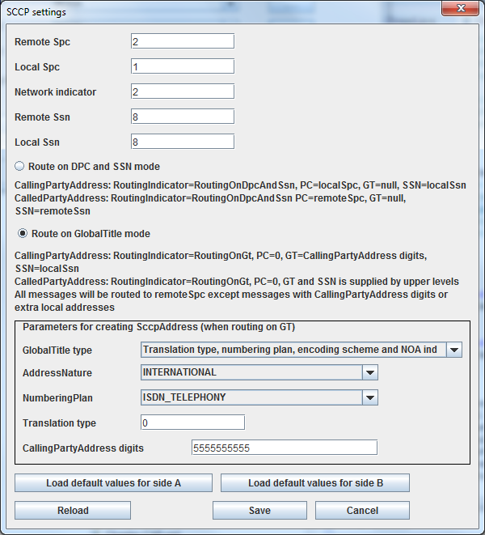
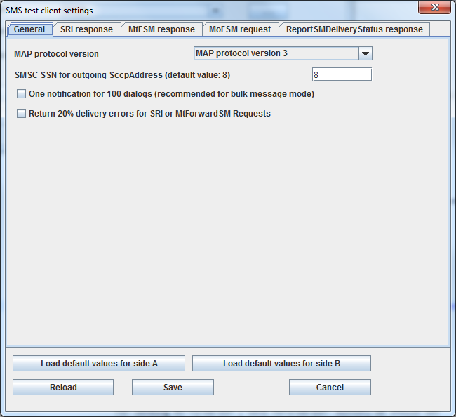
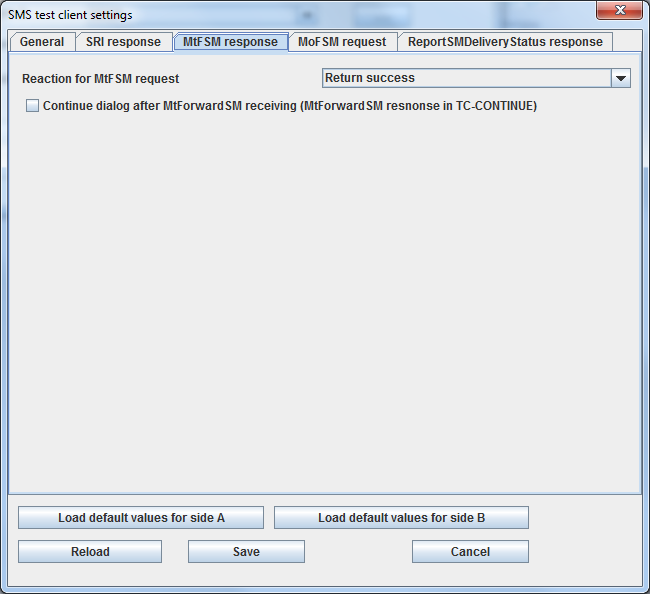
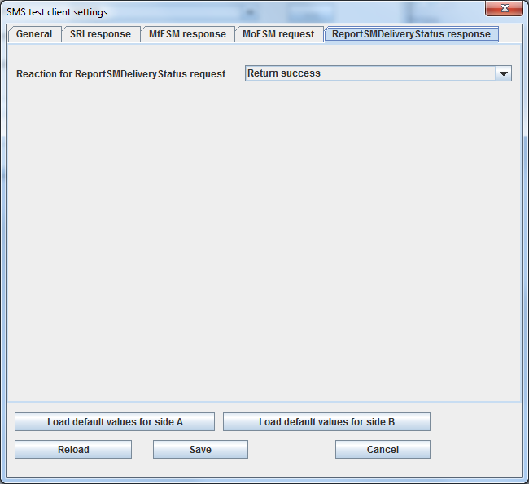
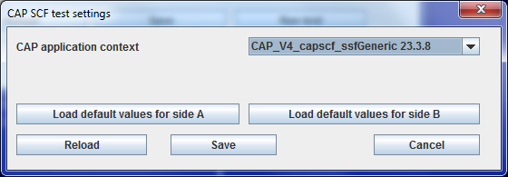
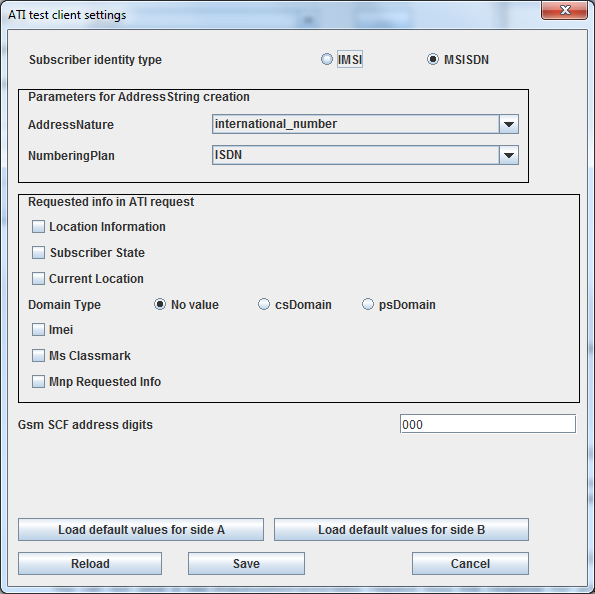

[[_simulator]]
= SS7 Simulator

SS7 Simulator is an application for testing the {this-platform} {this-application} and understanding its functionality.
The test cases will allow you to conduct various test scenarios and explore the Stack.
The Simulator is also a good example of how to use this Stack.
For details on installing the Simulator please refer to the Installation Guide.
To know more about Running the Simulator please refer to <<_running_ss7_simulator>> in this guide. 

Before running a test all relevant layers of the Simulator must be configured.
After running a test, you can perform some actions depending on the test.
The results of the test are emitted as "notifications". Notifications are displayed in the GUI interface of the Simulator and JConsole application (which is also a GUI interface). Notifications are also written into a file "<host name>.log" (for example "a1.log") as well as printed onto a console. 

[[_simulator_configuring_layers]]
== Configuring {this-platform} {this-application}  Simulator 

You must configure all relevant layers and the Testing Task prior to running a test with the Simulator.
For details on how to launch the form for configuring the simulator, refer to <<_procedure_test_simulator>>.

[[_simulator_configuring_layers_sccp]]
=== SCCP Layer of the Simulator 

SCCP layer supports message processing in two modes:		 

* Route on DPC and SSN mode 
* Route on GlobalTitle mode 	

For both modes you must set the following options: 

* Remote SPC 
* Local SPC 
* Network indicator 
* Remote SSN 
* Local SSN 	

When the SCCP layer is started, the following are created: 

* Mtp3ServiceAccessPoint (using Local SPC and Network indicator) with a single Mtp3Destination (Remote SPC, all SLS's) 
* RemoteSpc (using Remote SPC) 
* RemoteSsn (using Remote SPC and Remote SSN) 	

For "Route on GlobalTitle" mode there are few extra options as below: 

* GlobalTitle type ("Nature of address indicator only", "Translation type only", "Translation type, numbering plan and encoding scheme", "Translation type, numbering plan, encoding scheme and NOA ind"), the last choice is default. 
* AddressNature 
* NumberingPlan 
* Translation type (those four options are used for CalledPartyAddress, CallingPartyAddress and routing rules) 
* CallingPartyAddress digits 	

If the "Route on GlobalTitle" mode is used, two rules for routing are created when the SCCP layer is started.
All remotely originated messages are routed to a local user,  All locally originated messages are routed to a remote user (to a peer with Remote SPC address). 

SCCP layer provide CalledPartyAddress and CallingPartyAddress for upper layers and test cases.
When "Route on DPC and SSN" mode is used, these are  ROUTING_BASED_ON_DPC_AND_SSN with no GlobalTitle, pc=Local SPC (for CallingPartyAddress) or Remote SSN (for CalledPartyAddress), SSN=Local SSN and Remote SSN accordingly. 

When "Route on GlobalTitle" mode ROUTING_BASED_ON_GT is used: 

* CallingPartyAddress is created based on CallingPartyAddress digits and Local SSN. 
* CalledPartyAddress is created using digits and SSN that are supplied by upper levels or test cases. 	

.SCCP Settings Form

[[_simulator_tests]]
== SS7 Simulator Test Cases 

[[_simulator_test_ussdserver]]
=== USSD Server 

UssdServer test can work in manual and automatic modes.
In the manual mode a user manually inserts the response message value and sends ProcessUnstructuredSs response (or UnstructuredSs request) to the Ussd client.
In the automatic mode UssdServer automatically sends a predefined message as an ProcessUnstructuredSs response ("Auto sending ProcessUnstructuredSsResponse" option) or automatically sends a predefined message as an UnstructuredSs request and then  sends a predefined message ProcessUnstructuredSs response ("Auto sending Unstructured_SS_Request then after response sending ProcessUnstructuredSsResponse" option). Use "Auto sending ProcessUnstructuredSsResponse" option for UssdServer if UssdClient is used for a load test ("Auto sending ProcessUnstructuredSSRequest"). For load tests we recommend to check the option "One notification for 100 dialogs" for preventing too many notifications when load testing.
 

UssdServer test can perform followng tasks: 

* Sending a ProcessUnstructuredSs response / UnstructuredSs request in automatic or manual modes.
  Ussd Client must initiate a dialog using ProcessUnstructuredSs request. 
* Manually sending an UnstructuredSsNotify.	

.Ussd Server settings form
image::images/Simulator-Example8.png[]

[[_simulator_test_ussdclient]]
=== USSD Client 

UssdClient test can perform following tasks: 

* Sending a ProcessUnstructuredSs request, waiting for the answer and displaying the answer  
* Sending a UnstructuredSs response as an answer for UnstructuredSs request     
* Receiving UnstructuredSs notify and displaying it 
* Special case for load testing: Sending to the Ussd server a flow of ProcessUnstructuredSs requests without stopping (and receiving responses). 	

For working in the manual mode select the option "Manual operation", for auto sending messages - the option "Auto sending ProcessUnstructuredSSRequest".   You can send ProcessUnstructuredSs request and UnstructuredSs response only manually by inserting a message text and  pressing buttons.
For working in the auto mode you should define the string of auto processUnstructuredSs request and the count of maximum active MAP dialogs (default value is 10). The more dialogs is defined the more messages per second will be sent.
Msisdn, data coding schema and alerting pattern values should be also configured before test starting.
For the auto mode we recomment to check the option "One notification for 100 dialogs" for preventing too many notifications when load testing.
 

You can send ProcessUnstructuredSs request and UnstructuredSs response manually by inserting a message text and  pressing buttons.
You can not send a new ProcessUnstructiredSs request till the response for previos request has been received (or till dialog timeout). You can also manually close the current dialog by pressing "Close current dialog" button. 

.Ussd Client settings form
image::images/Simulator-Example7.png[]

[[_simulator_test_smsserver]]
=== SMS Server 

SMS Server simulates the behavior of SMSC, it can: 

* Send sendRoutingInfoForSM to the HLR and receive the response 
* Send mt-forwardSM to the VLR and receive the response  
* Send sendRoutingInfoForSM to the HLR, receive the response and send mt-forwardSM using data from the first request  
* Receive mo-forwardSM request from VLR and display the received message  	

We need to set the following options to SMS server: 

* AddressNature and NumberingPlan for AddressString creation 
* TypeOfNumber and NumberingPlanIdentification SMS tpdu addresses 
* MAP protocol version (1, 2 or 3) (version 3 is default)  
* Character set for SMS message encoding (GSM7 or UCS2) 
* Origination Service center address string (this address must be equal the SCCP layer CallingPartyAddress digits)  
* HLR and VLR SSN values (default values are 8 and 6)  	

NOTE: if you want to use SMS Server and SMS Client for sending SMS to each other: set HLR SSN at SMS Server the equal value that VLR SSN (8 in our case) 

.SMS client settings form
image::images/Simulator-Example11.png[]

After starting SMS server you can: 

* For sending sendRoutingInfoForSM ("Send SRIForSM" button) we should set "Destination ISDN number" 
* For sending sendRoutingInfoForSM and then mt-forwardSM ("Send SRIForSM + MtForwardSM" button) we should set "Message text", "Destination ISDN number" and "Origination ISDN number" 
* For sending mt-forwardSM only ("Send MtForwardSM" button) we should set "Message text", "IMSI", "VLR number" and "Origination ISDN number"  	

[[_simulator_test_smsclient]]
=== SMS Client 

SMS Client simulates the behavior of HLR or VLR, it can: 

* Receive sendRoutingInfoForSM from SMSC and send as a response predefined IMSI and VLR number 
* Receive mt-forwardSM from SMSC and display the received message 
* Send mo-forwardSM to the SMSC  	

We need to set the following options to SMS client: 

* AddressNature and NumberingPlan for AddressString creation 
* TypeOfNumber and NumberingPlanIdentification SMS tpdu addresses 
* MAP protocol version (1, 2 or 3) (version 3 is default)  
* Character set for SMS message encoding (GSM7 or UCS2)  
* Destination Service center address string (this address must be equal the SCCP layer CallingPartyAddress digits) 
* SMSC SSN value (default value is 8)  
* IMSI and VLR addresses values that will be used when responding on sendRoutingInfoForSM  	

image::images/Simulator-Example10_01.png[]

image::images/Simulator-Example10_03.png[]
.SMS client settings form

After starting SMS client you can: 

* For sending mo-forwardSM ("Send MoForwardSM" button) we should set "Message text", "Destination ISDN number" and "Origination ISDN number" 
* When recieving sendRoutingInfoForSM client automatically generate a response with preconfigured IMSI and VLR address 						 	

[[_simulator_test_cap_scf]]
=== CAMEL SCF part

CAMEL SCF part simulates the behavior of CAMEL Service Control Function, it can: 

* Send InitiateCallAttempt message to CAMEL SSF 
* Send ApplyCharging message to CAMEL SSF 
* Send Cancel message to CAMEL SSF 
* Send Connect message to CAMEL SSF 
* Send Continue message to CAMEL SSF 
* Send ReleaseCall message to CAMEL SSF 
* Send RequestReportBCSMEvent message to CAMEL SSF     

We need to set the following options to CAMEL SCF: 

* CAP Apllication content         

Parameters of messages are hardcorded in current version and can not be configured. 

.CAMEL SCF settings form

After CAMEL SCF server starting you can: 

* For initiating of CAP dialog and sending InitiateCallAttempt - press "InitiateCallAttempt" button. 
* For continuing of CAP dialog with sending ApplyCharging, Cancel, Connect, Continue, ReleaseCall or RequestReportBCSMEvent - press corresponded buttons. 
* For ending of CAP dialog - press "Close Dialog" button.     

[[_simulator_test_cap_ssf]]
=== CAMEL SSF part

CAMEL SSF part simulates the behavior of CAMEL Service Switching Function, it can: 

* Send InitialDP message to CAMEL SCF 
* Send AssistRequestInstructions message to CAMEL SCF 
* Send ApplyChargingReport message to CAMEL SCF 
* Send EventReportBCSM message to CAMEL SCF     

We need to set the following options to CAMEL SSF: 

* CAP Apllication content        

Parameters of messages are hardcorded in current version and can not be configured. 

.CAMEL SSF settings form
image::images/Simulator-Example13.png[]

After CAMEL SSF server starting you can: 

* For initiating of CAP dialog and sending InitialDP or AssistRequestInstructions message - press corresponded button. 
* For continuing of CAP dialog with sending ApplyChargingReport or EventReportBCSM - press corresponded buttons. 
* For ending of CAP dialog - press "Close Dialog" button.     

[[_simulator_test_atiserver]]
=== ATI Server 

ATI operation server task can be used for responding for AniTimeInterrogation MAP request.
There are no configurable options for this mode now.
SS7 Simulator will auto respond with ARI response with hardcoded parameters. 

ATI Server test can perform followng tasks: 

* Auto sending of ATI Response.     

[[_simulator_test_aticlient]]
=== ATI Client 

ATI Client test can perform following tasks: 

* Sending a AnyTimeInterrogation MAP (ATI) request and displaying of ATI response.    

For sending of ATI Request we need to specify IMSI / MSISDN digits and push "Send ATI Request" button.
 

Before running of ATI Client a user need to specify parameters: 

* Subscriber identity type (IMSI / MSISDN (default)).  
* AddressNature and NumberingPlan for AddressString Creation.
* Requested info - which parameters will be requested from ATI server.
* GSM SCF address digits.    

.ATI Client settings form

