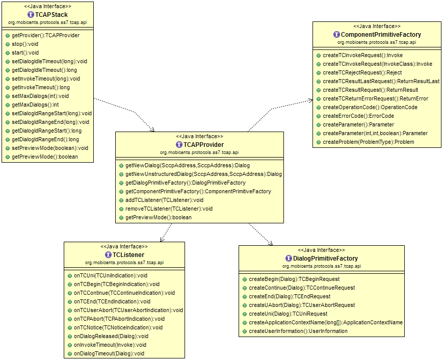

= TCAP

The Transaction Capabilities Application Part (TCAP) is defined in ITU-T Recommendations Q.771-Q.775.
TCAP allows services at network nodes to communicate with each other using an agreed-upon set of data elements.
The primary purpose of TCAP is to facilitate multiple concurrent dialogs between the same sub-systems on the same machines,  using Transaction IDs to differentiate these, similar to the way TCP ports facilitate multiplexing connections between  the same IP addresses on the Internet. 

== {this-platform} {this-application}  TCAP Usage

The [class]`org.mobicents.protocols.ss7.tcap.api.TCAPStack` interface defines the methods required to represent the TCAP Protocol Stack.
TCAPStack exposes [class]`org.mobicents.protocols.ss7.tcap.api.TCAPProvider` that interacts directly with the TCAPStack.
TCAPProvider defines methods that will be used by TCAP User Part to create new  [class]`org.mobicents.protocols.ss7.tcap.api.tc.dialog.Dialog` to be sent across the network.
TCAP User Part also allows to register[class]``org.mobicents.protocols.ss7.tcap.api.TCListener`` to listen for TCAP messages. 

TCAPProvider also exposes [class]`org.mobicents.protocols.ss7.tcap.api.DialogPrimitiveFactory` to create dialog primitives  and [class]`org.mobicents.protocols.ss7.tcap.api.ComponentPrimitiveFactory` to create components.
Components are a means of invoking an operation at a remote node. 

The UML Class Diagram is depicted in the figure below: 

.Restcomm jSS7 Stack TCAP Class Diagram

The [class]`org.mobicents.protocols.ss7.tcap.TCAPStackImpl` is a concrete implementation of [class]`TCAPStack`.
The TCAP User Part gets access to [class]`TCAPProvider` by doing JNDI lookup as explained in the <<_design_overview_ss7_service>>.
 

[source,java]
----
	
		InitialContext ctx = new InitialContext();
		try {
			String providerJndiName = "java:/mobicents/ss7/tcap";
			this.tcapProvider = ((TCAPProvider) ctx.lookup(providerJndiName));
		} finally {
			ctx.close();
		}
----

The TCAP User Part should register the concrete implementation of  [class]`TCListener` with [class]`TCAPProvider` to listen for incoming TCAP messages. 

[source,java]
----

	public class ClientTest implements TCListener{
			.....		
	        tcapProvider.addTCListener(this);
	        ....
	}
----

TCAP User Part leverages [class]`TCAPProvider` to create a new Dialog.
The components between the nodes are exchanged within this Dialog. 

[source,java]
----

		SccpAddress localAddress = new SccpAddress(RoutingIndicator.ROUTING_BASED_ON_DPC_AND_SSN, 1, null, 8);
		SccpAddress remoteAddress = new SccpAddress(RoutingIndicator.ROUTING_BASED_ON_DPC_AND_SSN, 2, null, 8);
		clientDialog = this.tcapProvider.getNewDialog(localAddress, remoteAddress);
----

The TCAP User Part leverages [class]`ComponentPrimitiveFactory` to create new components.
These components are sent using the dialog. 

Below is a list of common scenarios using the TCAP stack : 

* Creating a TCAP Dialog by invoking the methods `TCAPProvider.getNewDialog()` or `getNewUnstructuredDialog()`
* Adding components into a Dialog for sending by `Dialog.sendComponent();`
* Sending a TCAP message TC-UNI, TC-BEGIN, TC-CONTINUE, TC-END or TC-ABORT via `Dialog.send()` methods.
* Waiting for responses from a peer
* When the TCAP stack receives a message from a peer, events like `TCListener.onTCUni()`, `onTCBegin()`, `onTCContinue()`, `onTCEnd()`, `onTCUserAbort()`, `onTCPAbort()` will be invoked.
* After an Invoke component is received, a TCAP-User should process it and do one of the below:
+
** send a response (ReturnResult, ReturnResulLast components) or  
** send an error (ReturnError or Reject components) or 
** invoke Dialog.processInvokeWithoutAnswer() method if TCAP-Users will not answer to the Invoke. 

[source,java]
----

		//create some INVOKE
        Invoke invoke = cpFactory.createTCInvokeRequest();
        invoke.setInvokeId(this.clientDialog.getNewInvokeId());
        OperationCode oc = cpFactory.createOperationCode();
        oc.setLocalOperationCode(12L);
        invoke.setOperationCode(oc);
        //no parameter
        this.clientDialog.sendComponent(invoke);
----

== {this-platform} {this-application}  TCAP User Part Example

Below is a TCAP User Part example.
This example creates a dialog and exchanges messages within a structured dialog.
Refer to source for function calls. 

[source,java]
----
	
		
package org.mobicents.protocols.ss7.tcap;

import javax.naming.InitialContext;
import javax.naming.NamingException;

import org.mobicents.protocols.ss7.indicator.RoutingIndicator;
import org.mobicents.protocols.ss7.sccp.parameter.SccpAddress;
import org.mobicents.protocols.ss7.tcap.api.ComponentPrimitiveFactory;
import org.mobicents.protocols.ss7.tcap.api.TCAPException;
import org.mobicents.protocols.ss7.tcap.api.TCAPProvider;
import org.mobicents.protocols.ss7.tcap.api.TCAPSendException;
import org.mobicents.protocols.ss7.tcap.api.TCListener;
import org.mobicents.protocols.ss7.tcap.api.tc.dialog.Dialog;
import org.mobicents.protocols.ss7.tcap.api.tc.dialog.events.TCBeginIndication;
import org.mobicents.protocols.ss7.tcap.api.tc.dialog.events.TCBeginRequest;
import org.mobicents.protocols.ss7.tcap.api.tc.dialog.events.TCContinueIndication;
import org.mobicents.protocols.ss7.tcap.api.tc.dialog.events.TCEndIndication;
import org.mobicents.protocols.ss7.tcap.api.tc.dialog.events.TCEndRequest;
import org.mobicents.protocols.ss7.tcap.api.tc.dialog.events.TCNoticeIndication;
import org.mobicents.protocols.ss7.tcap.api.tc.dialog.events.TCPAbortIndication;
import org.mobicents.protocols.ss7.tcap.api.tc.dialog.events.TCUniIndication;
import org.mobicents.protocols.ss7.tcap.api.tc.dialog.events.TCUserAbortIndication;
import org.mobicents.protocols.ss7.tcap.api.tc.dialog.events.TerminationType;
import org.mobicents.protocols.ss7.tcap.asn.ApplicationContextName;
import org.mobicents.protocols.ss7.tcap.asn.comp.Invoke;
import org.mobicents.protocols.ss7.tcap.asn.comp.OperationCode;

/**
 * Simple example demonstrates how to use TCAP Stack
 * 
 * @author Amit Bhayani
 * 
 */
public class ClientTest implements TCListener {
	// encoded Application Context Name
	public static final long[] _ACN_ = new long[] { 0, 4, 0, 0, 1, 0, 19, 2 };
	private TCAPProvider tcapProvider;
	private Dialog clientDialog;

	ClientTest() throws NamingException {

		InitialContext ctx = new InitialContext();
		try {
			String providerJndiName = "java:/mobicents/ss7/tcap";
			this.tcapProvider = ((TCAPProvider) ctx.lookup(providerJndiName));
		} finally {
			ctx.close();
		}

		this.tcapProvider.addTCListener(this);
	}

	public void sendInvoke() throws TCAPException, TCAPSendException {
		SccpAddress localAddress = new SccpAddress(RoutingIndicator.ROUTING_BASED_ON_DPC_AND_SSN, 1, null, 8);
		SccpAddress remoteAddress = new SccpAddress(RoutingIndicator.ROUTING_BASED_ON_DPC_AND_SSN, 2, null, 8);

		clientDialog = this.tcapProvider.getNewDialog(localAddress, remoteAddress);
		ComponentPrimitiveFactory cpFactory = this.tcapProvider.getComponentPrimitiveFactory();

		// create some INVOKE
		Invoke invoke = cpFactory.createTCInvokeRequest();
		invoke.setInvokeId(this.clientDialog.getNewInvokeId());
		OperationCode oc = cpFactory.createOperationCode();
		oc.setLocalOperationCode(12L);
		invoke.setOperationCode(oc);
		// no parameter
		this.clientDialog.sendComponent(invoke);
		ApplicationContextName acn = this.tcapProvider.getDialogPrimitiveFactory().createApplicationContextName(_ACN_);
		// UI is optional!
		TCBeginRequest tcbr = this.tcapProvider.getDialogPrimitiveFactory().createBegin(this.clientDialog);
		tcbr.setApplicationContextName(acn);
		this.clientDialog.send(tcbr);
	}

	public void onDialogReleased(Dialog d) {
	}

	public void onInvokeTimeout(Invoke tcInvokeRequest) {
	}

	public void onDialogTimeout(Dialog d) {
		d.keepAlive();
	}

	public void onTCBegin(TCBeginIndication ind) {
	}

	public void onTCContinue(TCContinueIndication ind) {
		// send end
		TCEndRequest end = this.tcapProvider.getDialogPrimitiveFactory().createEnd(ind.getDialog());
		end.setTermination(TerminationType.Basic);
		try {
			ind.getDialog().send(end);
		} catch (TCAPSendException e) {
			throw new RuntimeException(e);
		}
	}

	public void onTCEnd(TCEndIndication ind) {
		// should not happen, in this scenario, we send data.
	}

	public void onTCUni(TCUniIndication ind) {
		// not going to happen
	}

	public void onTCPAbort(TCPAbortIndication ind) {
		// TODO Auto-generated method stub
	}

	public void onTCUserAbort(TCUserAbortIndication ind) {
		// TODO Auto-generated method stub
	}

	public void onTCNotice(TCNoticeIndication ind) {
		// TODO Auto-generated method stub

	}

	public static void main(String[] args) {

		try {
			ClientTest c = new ClientTest();
			c.sendInvoke();
		} catch (NamingException e) {
			// TODO Auto-generated catch block
			e.printStackTrace();
		} catch (TCAPException e) {
			// TODO Auto-generated catch block
			e.printStackTrace();
		} catch (TCAPSendException e) {
			// TODO Auto-generated catch block
			e.printStackTrace();
		}
	}
}
----
