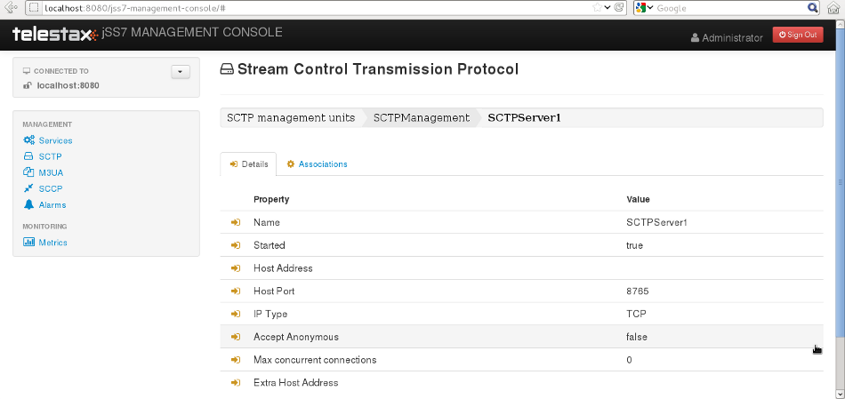

[[_managing_sctp]]
= SCTP Management

[[_managing_sctp_using_cli]]
== Using CLI

You can manage all SCTP related configurations through the Command Line Interface by using the `sctp` command.
You can create, destroy, start and stop SCTP Servers / Associations by issuing the `sctp` command with appropriate parameters.

[[_managing_sctp_using_gui]]
== Using GUI

The GUI will allow you to manage your SCTP Servers and Associations efficiently using a user-friendly interface.
Open a Web Browser and navigate to http://localhost:8080/jss7-management-console/. Click on the 'SCTP' link in the left panel.
The main panel will display the names of all configured SCTP Management units.
To configure or view the settings of a particular SCTP Management Unit you must click on the name of that unit.
The GUI will look similar to the figure below and is divided into three tabs.

.GUI - SCTP Management
image::images/GUI_SCTP_Management.png[]

The first tab will display the properties of the SCTP Management unit.
These details displayed here are fetched from the XML descriptor file [path]_jboss-beans.xml_, which is  located at [path]_$JBOSS_HOME/server/profile_name/deploy/mobicents-ss7-service/META-INF_, where  [app]`profile_name` is the server profile name.
These properties can be modified here in the GUI.
To modify them you must click the pencil, change the value and save.
The GUI will then display the modified values.

The other two tabs will allow you to manage and monitor all Servers and Associations within this SCTP Management unit.

[[_sctp_properties]]
== SCTP stack properties

[[_sctp_property_connectdelay]]
=== Connect Delay

[[_sctp_property_connectdelay_cli]]
==== Using CLI

You can set the 'Connect Delay (milliseconds)' by issuing the command `sctp set connectdelay` with appropriate parameters as described below.
You can verify this by issuing the command `sctp get connectdelay` which will display the value set for this property.

----

Name
	sctp set connectdelay

SYNOPSIS
	sctp set connectdelay <connectdelay> stackname <stack-name>

DESCRIPTION
	If the SCTP Socket is client-side, connectDelay specifies
	the delay time in milliseconds after which a connection
	with the server will be attempted. This delay is necessary
	when there is network disruption and the connection between
	the client and the server breaks, so that the SCTP stack
	doesn't continuously attempt to reconnect.
	Defalut is 30000 milliseconds.

PARAMETERS

	Standard Parameters

	<connectdelay>	-	Connect delay in milliseconds.

	Optional Parameters

	<stack-name>	-	Name of the stack on which this command is executed.
					If not passed, the first stack configured in ShellExecutor
					will be used.

EXAMPLES
	sctp set connectdelay 40000
----

[[_sctp_property_connectdelay_gui]]
==== Using GUI

On SCTP management page, click on pencil against the 'Connect Delay' property and text box becomes editable.
Change value and save.

[[_sctp_property_cc_delaythreshold]]
=== Thresholds for outgoing congestion control

[[_sctp_property_cc_delaythreshold_cli]]
==== Using CLI

SCTP library measures delays between the time when an outgoing message had been delivered from SS7 stack for sending and and the time when the message was sent to SCTP/TCP channel.
The more time this delay the more we have a congestion level.

The delay thresholds when the congestion level is increased to level 1, 2 and 3 is configured by parameters cc_delaythreshold_1, cc_delaythreshold_2 and cc_delaythreshold_3 (in seconds).

The delay thresholds when the congestion level is decreased to level 0, 1, and 2 is configured by parameters cc_backtonormal_delaythreshold_1, cc_backtonormal_delaythreshold_2 and cc_backtonormal_delaythreshold_3 (in seconds).

You can set the thresholds (in milliseconds) by issuing the commands `sctp set cc_delaythreshold_1`, `sctp set cc_delaythreshold_2`, `sctp set cc_delaythreshold_3`, `sctp set cc_backtonormal_delaythreshold_1`, `sctp set cc_backtonormal_delaythreshold_2` or `sctp set cc_backtonormal_delaythreshold_3` with appropriate parameters as described below.
You can verify this by issuing the commands `sctp get cc_delaythreshold_1`, `sctp get cc_delaythreshold_2`, `sctp get cc_delaythreshold_3`, `sctp get cc_backtonormal_delaythreshold_1`, `sctp get cc_backtonormal_delaythreshold_2` or `sctp get cc_backtonormal_delaythreshold_3`  which will display the value set for this property.

----

Name
	sctp set cc_delaythreshold_1
	sctp set cc_delaythreshold_2
	sctp set cc_delaythreshold_3
	sctp set cc_backtonormal_delaythreshold_1
	sctp set cc_backtonormal_delaythreshold_2
	sctp set cc_backtonormal_delaythreshold_3

SYNOPSIS
	sctp set cc_delaythreshold_1 <threshold> stackname <stack-name>
	sctp set cc_delaythreshold_2 <threshold> stackname <stack-name>
	sctp set cc_delaythreshold_3 <threshold> stackname <stack-name>
	sctp set cc_backtonormal_delaythreshold_1 <threshold> stackname <stack-name>
	sctp set cc_backtonormal_delaythreshold_2 <threshold> stackname <stack-name>
	sctp set cc_backtonormal_delaythreshold_3 <threshold> stackname <stack-name>

DESCRIPTION
	For outgoing messages congestion control stack needs to have 3 thresholds
	- delays of outgoing messages before it will be sent to IP channel (3
	levels - 1, 2, 3). If a delay time in seconds becomes more then value for
	level 1, 2 or 3, the Association's congestion level becomes to 1, 2 or 3.
	Default values:
	for cc_delaythreshold_1 is 2.5 seconds.
	for cc_delaythreshold_2 is 8   seconds.
	for cc_delaythreshold_3 is 14 seconds.
	for cc_backtonormal_delaythreshold_1 is 1.5 seconds.
	for cc_backtonormal_delaythreshold_2 is 5.5 seconds.
	for cc_backtonormal_delaythreshold_3 is 10  seconds.

PARAMETERS

	Optional Parameters

	<stack-name>	-	Name of the stack on which this command is executed.
					If not passed, the first stack configured in ShellExecutor
					will be used.

EXAMPLES
	sctp set cc_delaythreshold_1 2.5
	sctp set cc_delaythreshold_2 8
	sctp set cc_delaythreshold_3 14
	sctp set cc_backtonormal_delaythreshold_1 1.5
	sctp set cc_backtonormal_delaythreshold_2 5.5
	sctp set cc_backtonormal_delaythreshold_3 10
----

[[_sctp_property_cc_delaythreshold_gui]]
==== Using GUI

On SCTP management page, click on pencil against the 'SCTP congestion Threshold 1' or other needed property and text box becomes editable.
Change value and save.

[[_show_sctp_server]]
== View all SCTP (or TCP) Server Instances

[[_show_sctp_server_cli]]
=== Using CLI

You can view the details of all configured SCTP (or TCP) Server instances by issuing the command `sctp server show` as described below:

----

Name
	sctp server show

SYNOPSIS
	sctp server show stackname <stack-name> stackname <stack-name>

DESCRIPTION
	This command is used to view the details of all SCTP Server instances created.
	The information displayed will include the socket type (SCTP or TCP), name of the
	Server, state (whether started=false or true), the IP address and port that the
	Server is bound to. For multi-home SCTP Servers it will display all the
	IP addresses that are configured.

PARAMETERS

	Optional Parameters

	<stack-name>	-	Name of the stack on which this command is executed.
					If not passed, the first stack configured in ShellExecutor
					will be used.
----

[[_show_sctp_server_gui]]
=== Using GUI

Navigate to the specific SCTP Management unit and switch to the 'Servers' tab.
Here you can view a list of all the Servers created.
Every correctly configured Server will be displayed in a row and for each Server, the first column will display the name of the Server.
The icon adjacent to the name will be lit 'green' if the server is currently running or if the server is stopped the icon will be lit 'orange'. The second column will indicate the current state of the Server (Started / Stopped), the third column will allow you to Start / Stop the Server and the fourth column will allow you to delete the Server.

.GUI - SCTP Management - Servers
image::images/GUI_SCTP_Management_Servers.png[]

In the screen above, click on the name of the Server whose details you wish to view.
This will launch the Server Details and display all the configured properties of the selected Server.
The second tab in this view will allow you to view all Associations linked to this particular Server.
You can click on any Association name here to view the configured properties.
You can click on the bread crumbs at the top to return to any of the previous pages you navigated through.

.GUI - SCTP Management - Server Details
image::images/GUI_SCTP_Management_Server_Details.png[]

[[_create_new_sctp_server]]
== Create a new SCTP (or TCP) Server Instance

[[_create_new_sctp_server_cli]]
=== Using CLI

You can create a new SCTP Server by issuing the command `sctp server create` with appropriate parameters as described below:

----

Name
	sctp server create

SYNOPSIS
	sctp server create <sever-name> <host-ip> <host-port> <socket-type> stackname <stack-name>

DESCRIPTION
	This command is used to create a new SCTP Server (or TCP Server) instance.

PARAMETERS

	Standard Parameters

	<server-name>	-	Name of the new Server created. This must be
					unique and takes any String value.

	<host-ip>		-	The host IP address to which the SCTP Server
					socket will bind to.

					For SCTP multi-home support, you can pass multiple
					IP addresses as comma separated values. The Server
					socket will bind to the primary IP address and
					when it becomes unavailable, it will automatically
					fall back to secondary address. If the socket-type
					is TCP, these comma separated values will be
					ignored and the Server socket will always bind to
					the primary IP address (the first value in the
					comma separated list).

	<host-port>		-	The host port to which the underlying SCTP Server
					socket will bind to.

	Optional Parameters

	<socket-type>	-	If you do not specify the socket-type as "TCP",
					by default it will be SCTP.

	<stack-name>	-	Name of the stack on which this command is executed.
						If not passed, the first stack configured in ShellExecutor
						will be used.

EXAMPLES
	sctp server create TestServer 127.0.0.1 2905

	The above command will create a new SCTP Server identified as TestServer and bind
	the Server socket to the IP address 127.0.0.1 and port 2905.

	sctp server create TestServerMulti 10.2.50.145,10.2.50.146 2905

	The above command will create a new SCTP Server identified as TestServerMulti and
	bind the Server socket to the IP address 10.2.50.145 and port 2905. If 10.2.50.145
	is unavailable, the Server will automatically fall back to 10.2.50.146.

	sctp server create TestServerTCP 127.0.0.1 2906 TCP

	The above command will create a new TCP Server identified as TestServerTCP and
	bind the socket to the IP address 127.0.0.1 and port 2906.
----

[[_create_new_sctp_server_gui]]
=== Using GUI

.GUI - SCTP Management - Server Create

.Procedure: Create new SCTP Server (or TCP Server) instance using GUI
. In the section for Servers in the SCTP Management Unit window, click on the 'Create Server' button.
  This will launch a pop-up 'Create Server'.
. In the 'Create Server' pop-up, add details of the new Server.
  You must ensure that you fill in all the mandatory parameters (Name, Host Address, Host Port, IP Type, Max Concurrent Connections). For definition of these parameters, please refer to the description of the CLI command for the same in the preceding section.
. Verify the details entered and then click on the 'Create' button.
  A new SCTP Server (or TCP Server) will be created with parameters as specified.
  If there is an error in creating the Server then you will find the details of the error in the Management Console Log section below.
. Click on the 'Close' button to close the 'Create Server' pop-up.

[[_modify_sctp_server]]
== Modify a SCTP (or TCP) Server Instance

[[_modify_sctp_server_cli]]
=== Using CLI

You can modify existed SCTP Server by issuing the command `sctp server modify` with appropriate parameters as described below:

----

Name
	sctp server modify

SYNOPSIS
	sctp server modify <sever-name> <stack-name> host <host-ip> port <host-port> sockettype <socket-type>
	anonymconnect <accept-anonymous-connections> concurrentconnect <max-concurrent-connections-count>
	extraaddresses <extra-host-addresses>

DESCRIPTION
	This command is used to modify a existed SCTP Server (or TCP Server) instance.

PARAMETERS

	Standard Parameters

	<server-name>	-	Name of the Server which will be modified.

	<stack-name>	-	Name of the stack on which this command is executed.

	Optional Parameters

	<host-ip>		-	The host IP address to which the SCTP Server
					socket will bind to.

	<host-port>		-	The host port to which the underlying SCTP Server
					socket will bind to.

	<socket-type>	-	Socket-type "TCP"/"SCTP".

	<extra-host-addresses>	-	For SCTP multi-home support, you can pass multiple
					IP addresses as comma separated values. The Server
					socket will bind to the primary IP address and
					when it becomes unavailable, it will automatically
					fall back to secondary address. If the socket-type
					is TCP, these comma separated values will be
					ignored and the Server socket will always bind to
					the primary IP address (host-ip).

	<accept-anonymous-connections>	-	will server check ip and port of the CLient
										true/false

	<max-concurrent-connections-count>	-	set max concurrent connections

EXAMPLES
	sctp server modify TestServer sctpManagement1 port 2905

	The above command will modify a new SCTP Server identified as TestServer
	which belongs to SCTP management with name sctpManagement1 and modified
	the Server socket to the port 2905. Server MUST be stopped.

SEE ALSO
	sctp, sctp server destroy, sctp server start, sctp server stop, sctp server show,
	sctp association create, sctp association destroy, sctp association show

----

[[_destroy_sctp_server]]
== Delete a SCTP (or TCP) Server Instance

[[_destroy_sctp_server_cli]]
=== Using CLI

You can delete an existing SCTP Server by issuing the command `sctp server destroy` with appropriate parameters as described below:

----

Name
	sctp server destroy

SYNOPSIS
	sctp server destroy <sever-name> stackname <stack-name>

DESCRIPTION
	This command is used to delete an existing SCTP Server instance. You must ensure
	that the Server is stopped prior to deletion.

PARAMETERS

	Standard Parameters

	<server-name>		-	Name of the Server instance to be deleted.

	Optional Parameters

	<stack-name>	-	Name of the stack on which this command is executed.
						If not passed, the first stack configured in ShellExecutor
						will be used.

EXAMPLES
	sctp server destroy TestServer

	The above command will destroy the Server identified by the name TestServer.
----

[[_destroy_sctp_server_gui]]
=== Using GUI

.Procedure: Delete SCTP Server (or TCP Server) instance using GUI
. Navigate to the 'Servers' section in the SCTP Management Unit window and locate the row corresponding to the Server you wish to delete.
. You must ensure that the Server is stopped prior to deletion.
  If the Server is stopped, the last column for 'Delete' will display a 'x' button in red and will be enabled.
  If the Server is currently running, the 'x' button will be disabled.
  You can only delete the server if it is stopped.
. Click on the red 'x' button to delete the corresponding Server instance.

[[_start_sctp_server]]
== Start a SCTP (or TCP) Server Instance

[[_start_sctp_server_cli]]
=== Using CLI

You can start an existing SCTP Server by issuing the command `sctp server start` with appropriate parameters as described below:

----

Name
	sctp server start

SYNOPSIS
	sctp server start <sever-name> stackname <stack-name>

DESCRIPTION
	This command is used to start an existing SCTP Server instance. Upon executing
	this command, the underlying SCTP server socket is bound to the IP: Port
	configured for this Server instance at the time of creation using the
	"sctp server create" command.

PARAMETERS

	Standard Parameters

	<server-name>	-	Name of the Server instance to be started.

	Optional Parameters

	<stack-name>	-	Name of the stack on which this command is executed.
						If not passed, the first stack configured in ShellExecutor
						will be used.

EXAMPLES
	sctp server start TestServer

	The above command will start the previously created Server instance identified
	by the name TestServer and bind the underlying socket to the IP address and port
	configured for TestServer at the time of creation.
----

[[_start_sctp_server_gui]]
=== Using GUI

.Procedure: Start a SCTP Server (or TCP Server) instance using GUI
. Navigate to the 'Servers' section in the SCTP Management Unit window and locate the row corresponding to the Server you wish to start.
. Click on the 'Start' button in the actions column to start the corresponding Server instance.
  The SCTP Server will be started and the underlying SCTP server socket will be bound to the IP: Port configured for this Server instance at the time of creation.
. If the Server has started successfully you will find the status indicating the Server as 'Started' and the Server's icon will be lit green.
  If there is an error and the Server failed to start, you will find details of the error in the Management Console log below.

[[_stop_sctp_server]]
== Stop a SCTP (or TCP) Server Instance

[[_stop_sctp_server_cli]]
=== Using CLI

You can stop a currently running SCTP Server by issuing the command `sctp server stop` with appropriate parameters as described below:

----

Name
	sctp server stop

SYNOPSIS
	sctp server stop <sever-name> stackname <stack-name>

DESCRIPTION
	This command is used to stop an existing SCTP Server instance. Upon executing this
	command, the underlying SCTP server socket is closed and all resources are
	released.

PARAMETERS

	Standard Parameters

	<server-name>		-	Name of the Server instance to be stopped.

	Optional Parameters

	<stack-name>	-	Name of the stack on which this command is executed.
						If not passed, the first stack configured in ShellExecutor
						will be used.

EXAMPLES
	sctp server stop TestServer

	The above command will stop the currently running Server instance identified by
	the name TestServer, close the underlying socket and release all resources.
----

[[_stop_sctp_server_gui]]
=== Using GUI

.Procedure: Stop a SCTP Server (or TCP Server) instance using GUI
. Navigate to the 'Servers' section in the SCTP Management Unit window and locate the row corresponding to the Server you wish to stop.
. To stop a Server currently running, click on the 'Stop' button in the actions column of the row corresponding to the Server instance.
  When the Server is stopped the underlying SCTP server socket will be closed and all resources are released.

[[_show_sctp_association]]
== View all SCTP (or TCP) Associations

[[_show_sctp_association_cli]]
=== Using CLI

You can view the details of all configured SCTP (or TCP) Associations by issuing the command `sctp association show` as described below:

----

Name
	sctp association show

SYNOPSIS
	sctp association show stackname <stack-name>

DESCRIPTION
	This command is used to view the details of all SCTP Associations created.
	The information displayed will include the Association type (SERVER or CLIENT),
	name of the Association, state (whether started=false or true). For a CLIENT
	Association it will also display the host-ip, host-port and peer-ip, peer-port
	values.

	For multi-home SCTP, it will display all the IP addresses that are configured.
	For a SERVER Association, it will display the configured peer-ip and peer-port
	values.

PARAMETERS

	Optional Parameters

	<stack-name>	-	Name of the stack on which this command is executed.
						If not passed, the first stack configured in ShellExecutor
						will be used.
----

[[_show_sctp_association_gui]]
=== Using GUI

Navigate to the specific SCTP Management unit and switch to the 'Associations' tab.
Here you can view a list of all the Associations created.
Every correctly configured Association will be displayed in a row and for each Association, the first column will display the name of the Association.
The icon adjacent to the name will be lit 'green' if the Association is currently running or if the Association is stopped the icon will be 'orange'. The second column will indicate the current state of the Association (Started / Stopped) and the third column will allow you to delete the Association.

NOTE: You cannot start or stop a SCTP Association here in this window.
Every SCTP Association must be associated with an ASP (M3UA) and will automatically start or stop when the associated ASP is started or stopped.
For more details on how to associate with an ASP, please refer to <<_managing_m3ua>>.

.GUI - SCTP Management - Associations
image::images/GUI_SCTP_Management_Associations.png[]

In the screen above, click on the name of the Association whose details you wish to view.
This will launch the Association Details and display all the configured properties of the selected Association.

[[_create_sctp_association]]
== Create a new SCTP (or TCP) Association

[[_create_sctp_association_cli]]
=== Using CLI

You can create a new SCTP Association by issuing the command `sctp association create` with appropriate parameters as described below:

----

Name
	sctp association create

SYNOPSIS
	sctp association create <assoc-name> <CLIENT | SERVER> <server-name> <peer-ip>
	<peer-port> <host- ip> <host-port> <socket-type> stackname <stack-name>

DESCRIPTION
	This command is used to create a new SCTP (Client side or Server side)
	association.

PARAMETERS

	Standard Parameters

	<assoc-name>		-	Name of the new Association created. This must be
					unique and takes any String value.

	<CLIENT | SERVER>	-	Specify if this association is client side or
					server side. If it is client side, it will
					initiate the connection to peer. If it is server
					side, it will wait for peer to initiate the
					connection. The connection request will be
					accepted from peer-ip: peer:port.

	<peer-ip>		-	In a client side association, the server IP
					address to which the client is connecting to.

					In a server side association, the client IP
					address from which connections will be accepted.

	<peer-port>		-	In a client side association, the server Port
					to which the client is connecting to.

					In a server side association, the client port from
					which connections will be accepted.

	<host-ip>		-	In a client side association, the local IP address
					to which the socket will bind to.

					For SCTP multi-home support, you can pass multiple
					IP addresses as comma separated values. The
					Association will bind to the primary IP address
					and when it becomes unavailable, it will
					automatically fall back to secondary address.
					If the socket-type is TCP, these comma separated
					values will be ignored and the Assocation will
					always bind to the primary IP address (the first
					value in the comma separated list). This is
					required only for a client side Association.

					For a server side association, even if you specify
					these values it will be ignored.

	<host-port>		-	In a client side association, the local port to
					which the socket will bind to. This is
					required only for a client side Association.

					For a server side association, even if you specify
					these values it will be ignored.

	<server-name>	-	In a server-side association, the server-name must
					be passed to associate with the Server identified
					by that name. You must ensure that the Server
					identified by server-name has already been created
					using the sctp server create command.

					In a client-side association, this is not required
					and you should not pass this parameter.

	Optional Parameters

	<socket-type>	-	If you do not specify the socket-type as "TCP",
					by default it will be SCTP. If it is a
					SERVER SCTP Association, the socket-type must
					match with the one specified while creating the
					Server.

	<stack-name>	-	Name of the stack on which this command is executed.
					If not passed, the first stack configured in ShellExecutor
					will be used.

EXAMPLES
	sctp association create Assoc1 CLIENT
	192.168.56.101 2905 192.168.56.1,192.168.56.1 2905

	The above command will create a new CLIENT SCTP Association identified as Assoc1.
	The client side will initiate the connection. It will bind the
	host-ip 192.168.56.1 and host-port 2905 to the Server IP 192.168.56.101 and
	port 2905.

	sctp association create Assoc2 SERVER TestServer 192.168.56.1 2905

	The above command will create a new SERVER SCTP association with the Server
	identified as TestServer and accept connections from peer whose IP address is
	192.168.56.1 and port 2905.
----

[[_create_sctp_association_gui]]
=== Using GUI

.Procedure: Create new SCTP (or TCP) Association (Client side or Server side)
. In the section for Associations in the SCTP Management Unit window, click on the 'Create Association' button.
  This will launch a pop-up 'Create Association'.
. In the 'Create Association' pop-up, add details of the new Association.
  You must ensure that you fill in all the mandatory parameters: Name, Peer Address, Peer Port, Server Name (for Server side Association), Host Address and Host Port (for Client side Association). For definition of these parameters, please refer to the description of the CLI command for the same in the preceding section.
. Verify the details entered and then click on the 'Create' button.
  A new SCTP Association (or TCP Association) will be created with parameters as specified.
  If there is an error in creating the Association then you will find the details of the error in the Management Console Log section below.
. Click on the 'Close' button to close the 'Create Association' pop-up.

[[_modify_sctp_association]]
== Modify existed SCTP (or TCP) Association

[[_modify_sctp_association_cli]]
=== Using CLI

You can modify existed SCTP Association by issuing the command `sctp association modify` with appropriate parameters as described below:

----

Name
	sctp association modify

SYNOPSIS
	sctp association modify <assoc-name> <stack-name> <CLIENT | SERVER> servername <server-name>
	peerhost <peer-ip> peerport <peer-port> host <host-ip> port <host-port> sockettype <socket-type>
	extraaddresses <extra-host-addresses>

DESCRIPTION
	This command is used to modify a existed SCTP (Client side or Server side)
	association.

PARAMETERS

	Standard Parameters

	<assoc-name>	-	Name of the existed Association which will be modified.

	<stack-name>	-	Name of the stack on which this command is executed.

	<CLIENT | SERVER>	-	Specify if this association is client side or
					server side.

	Optional Parameters

	<peer-ip>		-	In a client side association, the server IP
					address to which the client is connecting to.

					In a server side association, the client IP
					address from which connections will be accepted.

	<peer-port>		-	In a client side association, the server Port
					to which the client is connecting to.

					In a server side association, the client port from
					which connections will be accepted.

	<host-ip>		-	In a client side association, the local IP address
					to which the socket will bind to.

	<host-port>		-	In a client side association, the local port to
					which the socket will bind to. This is
					required only for a client side Association.

					For a server side association, even if you specify
					these values it will be ignored.

	<server-name>	-	In a server-side association, the server-name.

					In a client-side association, this is not required
					and you should not pass this parameter.

	<socket-type>	-	socket-type "TCP"/"SCTP". If it is a
					SERVER SCTP Association, the socket-type must
					match with the one specified while creating the
					Server.

	<extra-host-addresses> - For SCTP multi-home support, you can pass multiple
					IP addresses as comma separated values. The
					Association will bind to the primary IP address
					and when it becomes unavailable, it will
					automatically fall back to secondary address.
					If the socket-type is TCP, these comma separated
					values will be ignored and the Assocation will
					always bind to the primary IP address (host). This is
					required only for a client side Association.

					For a server side association, even if you specify
					these values it will be ignored.

EXAMPLES
	sctp association modify Assoc1 sctpManagement1 CLIENT port 2476

	The above command will modify a CLIENT SCTP Association identified as Assoc1
	which belongs to SCTP management with name sctpManagement1.

	If an Association is connected stack will drop the connection firstly.
	Then the Association will reconnect itself.

SEE ALSO
	sctp, sctp server create, sctp server destroy, sctp server start,
	sctp server stop, sctp server show, sctp association destroy,
	sctp association show
----

[[_destroy_sctp_association]]
== Delete a SCTP (or TCP) Association

[[_destroy_sctp_association_cli]]
=== Using CLI

You can delete an existing SCTP Association by issuing the command `sctp association destroy` as described below:

----

Name
	sctp association destroy

SYNOPSIS
	sctp association destroy <assoc-name> stackname <stack-name>

DESCRIPTION
	This command is used to delete an existing SCTP Association identified by the
	name assoc-name.

PARAMETERS

	Standard Parameters

	<assoc-name>	-	Name of the Association to be deleted.

	Optional Parameters

	<stack-name>	-	Name of the stack on which this command is executed.
					If not passed, the first stack configured in ShellExecutor
					will be used.

EXAMPLES
	sctp association destroy Assoc1

	The above command will destroy the Association identified by the name Assoc1.
----

[[_destroy_sctp_association_gui]]
=== Using GUI

.Procedure: Delete SCTP Association (or TCP Association) instance
. Navigate to the 'Associations' section in the SCTP Management Unit window and locate the row corresponding to the Association you wish to delete.
. You must ensure that the Association is stopped prior to deletion.
  If the Association is stopped, the last column for 'Delete' will display a 'x' button in red.
  If the Association is currently running, the 'x' button will be displayed in orange.
  You can only delete the Association if it is stopped and the 'x' button is displayed in red.
. Click on the red 'x' button to delete the corresponding Association instance.
