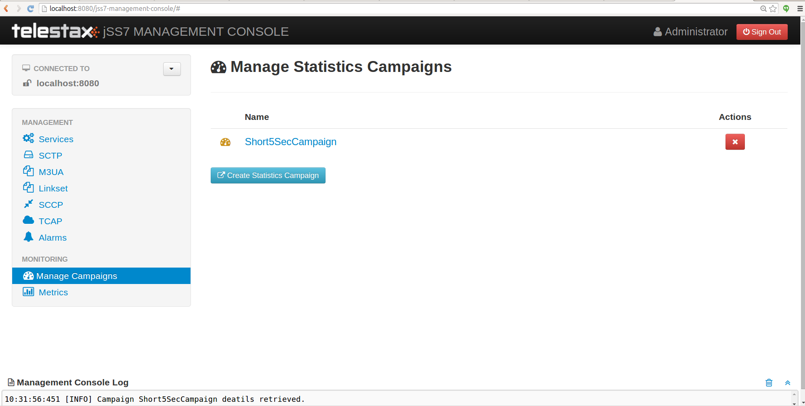
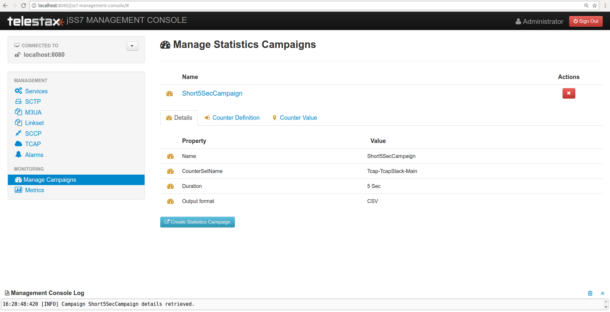

[[_managing_statistics]]
= Statistics

The GUI will allow you to create campaigns of fixed duration for gathering statistics data.
Campaign allows to select time period over which these statistics have been gathered (in hours, minutes and seconds). Once Campaign is defined, the statistics can be observed by clicking newly created campaign name or you can also navigate to Metrics (click Metrics on left panel) to get graph of statistics. 

[[_managing_statistics_create]]
== Create Campaign

To create new campaign open a Web Browser and navigate to http://localhost:8080/jss7-management-console/.  Click on the 'Manage Campaigns' link in the left panel.
The main panel will display the names of all existing campaigns and also button to create new campaign.
The GUI will look similar to the figure below. 

.GUI - Campaigns

Click on 'Create Statistics Campaign' button to create new campaign.
Select the stack from 'Counter Definition Set Name' drop down on which you want to define new campaign.
Next select the time period from 'Duration' drop down and enter unique 'Campaign Name'.
An 'Output format' field allows you to select a type of statistics logging: CSV, verbose or both of them.

IMPORTANT: The stack on which new campaign is defined must have set 'Statistics Enabled' property to true 

[[_managing_statistics_manage]]
== View Campaigns

The GUI will allow you to view existing campaigns.
On the main panel click campaign name.
The GUI will look similar to the figure below and is divided into tabs.
 

The first tab will display the properties of the campaign.
Second tab explains all the counters in this campaigns and their definition.
Last tab provides the values for each of these counters.
Last tab also displays the 'Start Time' and 'End Time' representing time duration for which sample was collected.
 

.GUI - Campaigns View

[NOTE]
====
{this-platform} {this-application} doesn't persist the statistics, hence the data collected for campaign period refresh's every defined 'Duration'. User must refresh the page every 'Duration'  period to gather statistics data for previous time period. 

Nevertheless you can also click on 'Metrics' link on left panel, select the Campaign and observe the statistics graph.
The metrics page gathers data from time page was loaded till user navigates  away.
Hence graph will show historic data from point page was loaded. 
====

[[_managing_statistics_logging]]
== Logging Stats

The GUI will allow you to view stats in real time.
But the stats are not stored in the Database for you to analyse at a later point of time.
However {this-platform} {this-application} gives you an option to have the stats logged every refresh period for all the existing campaigns.
You can look at the log files at any point of time for analysing or understanding the performance. 

If you wish to have stats logged, you must configure the settings in the file [path]_jboss-5.1.0.GA/server/default/conf/jboss-log4j.xml_.
If you are running the platform as standalone, then you should configure in [path]_log4j.xml_. 

Logging stats to main server log file::
If you wish to have the stats logged in the main server log file located at [path]_jboss-5.1.0.GA/server/default/log/server.log_,  then you must add a new category to the [path]_jboss-log4j.xml_ as shown below and set priority value to "DEBUG". For verbose stats:
----

<category name="org.mobicents.protocols.ss7.oam.common.statistics.StatsPrinter" additivity="false"> 
	    <priority value="DEBUG" /> 
</category>
----		
and for a CSV stats:
----

<category name="org.mobicents.protocols.ss7.oam.common.statistics.CsvStatsPrinter" additivity="false">
	    <priority value="DEBUG" />
</category>
----

Logging stats to a separate stats log files::
If you wish to have the stats logged to a separate log files located at [path]_jboss-5.1.0.GA/server/default/log/stats.log_ and [path]_jboss-5.1.0.GA/server/default/log/csvstats.log_,  then you must add a new appenders to the [path]_jboss-log4j.xml_ and change category as shown below.
You must set the priority value to "DEBUG". 
----

<appender name="STATS" class="org.jboss.logging.appender.DailyRollingFileAppender"> 
<errorHandler class="org.jboss.logging.util.OnlyOnceErrorHandler"/> 
<param name="File" value="$
{jboss.server.home.dir}
/log/stats.log"/> 
<param name="Append" value="true"/> 
<param name="MaxFileSize" value="500KB" />
<param name="MaxBackupIndex" value="1" />
<param name="Threshold" value="DEBUG"/>
<param name="DatePattern" value="'.'yyyy-MM-dd"/>
<layout class="org.apache.log4j.PatternLayout"> 
<param name="ConversionPattern" value="%d %-5p [%c] %m%n"/> 
</layout> 
</appender>
<category name="org.mobicents.protocols.ss7.oam.common.statistics.StatsPrinter" additivity="false"> 
<priority value="DEBUG" /> 
<appender-ref ref="STATS"/> 
</category>

<appender name="CSVSTATS" class="org.jboss.logging.appender.DailyRollingFileAppender">
<errorHandler class="org.jboss.logging.util.OnlyOnceErrorHandler"/>
<param name="File" value="$
{jboss.server.home.dir}
/log/csvstats.log"/>
<param name="Append" value="true"/>
<param name="MaxFileSize" value="500KB" />
<param name="MaxBackupIndex" value="1" />
<param name="Threshold" value="DEBUG"/>
<param name="DatePattern" value="'.'yyyy-MM-dd"/>
<layout class="org.apache.log4j.PatternLayout">
<param name="ConversionPattern" value="%d %-5p [%c] %m%n"/>
</layout>
</appender>
<category name="org.mobicents.protocols.ss7.oam.common.statistics.CsvStatsPrinter" additivity="false">
<priority value="DEBUG" />
<appender-ref ref="CSVSTATS"/>
</category>
----		

As of today {this-platform} {this-application} exposes statistics only for TCAP.
Future releases will allow statistics for M3UA, SCCP, MAP and CAP also. 
