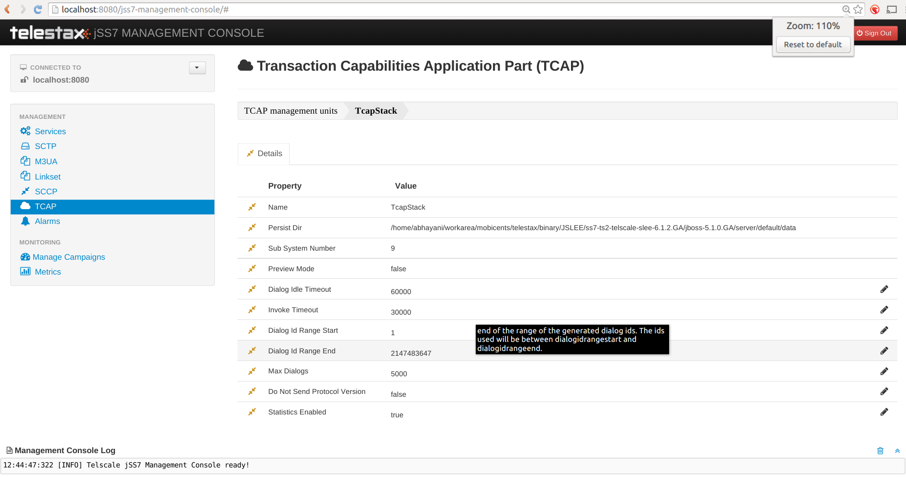

[[_managing_tcap]]
= TCAP Management

Transaction Capabilities Application Part  , from ITU-T recommendations Q.771-Q.775 or ANSI T1.114 is a protocol for Signalling System 7 networks.
Its primary purpose is to facilitate multiple concurrent dialogs between the same sub-systems on the same machines, using Transaction IDs to differentiate these, similar  to the way TCP ports facilitate multiplexing connections between the same IP addresses on the Internet. 

[[_managing_tcap_using_cli]]
== Using CLI

You can manage all TCAP stack properties through the Command Line Interface by using the `tcap` command. 

[[_managing_tcap_using_gui]]
== Using GUI

The GUI will allow you to manage your TCAP configurations efficiently using a user-friendly interface.
Open a Web Browser and navigate to http://localhost:8080/jss7-management-console/. Click on the 'TCAP' link in the left panel.
The main panel will display the names of all configured TCAP Management units.
To configure or view the settings of a particular TCAP Management Unit  you must click on the name of that unit.
The GUI will look similar to the figure below.
 

.GUI - TCAP Management

The first tab will display the properties of the TCAP Management unit.
These details displayed here are fetched from the XML descriptor file [path]_jboss-beans.xml_, which is  located at [path]_$JBOSS_HOME/server/profile_name/deploy/mobicents-ss7-service/META-INF_, where  [app]`profile_name` is the server profile name.
These properties can be modified here in the GUI.
To modify them you must click the pencil, change value and save.
The GUI will then display the modified values.
 

[[_tcap_properties]]
== TCAP stack properties

[[_tcap_property_dialogidletimeout]]
=== Dialog Idle Timeout

[[_tcap_property_dialogidletimeout_cli]]
==== Using CLI

You can set the 'dialogidletimeout' by issuing the command `tcap set dialogidletimeout` with appropriate parameters as described below.
You can verify this by issuing the command `tcap get dialogidletimeout` which will display the value set for this property. 

----

Name
	tcap set dialogidletimeout 

SYNOPSIS
	tcap set dialogidletimeout <dialogidletimeout> stackname <stack-name>

DESCRIPTION
	Sets millisecond value for dialog timeout. It specifies how long 
	dialog can be idle - not receive/send any messages.
	When a timeout occurs the method `TCListener.onDialogTimeout()` will be
	invoked. If a TCAP-User does not invoke `Dialog.keepAlive()` inside
	the method `TCListener.onDialogTimeout()`, the TCAP Dialog will be
	released.
	
PARAMETERS

	Standard Parameters

	<dialogidletimeout>	-	Timeout in milliseconds.
	
	Optional Parameters

	<stack-name>	-	Name of the stack on which this command is executed. 
					If not passed, the first stack configured in ShellExecutor
					will be used.	

EXAMPLES
	tcap set dialogidletimeout 30000
----

[[_tcap_property_dialogidletimeout_gui]]
==== Using GUI

On TCAP management page, click on pencil against the 'Dialog Idle Timeout' property and text box becomes editable.
Change value and save. 

[[_tcap_property_dialogidrangeend]]
=== Dialog Id Range End

TCAP stack can be configured to use a range of local DialogId values.
You may install a set of TCAP Stack instances with different DialogId ranges.
These ranges can be used for loadsharing of SS7 traffic between the TCAP instances.
All the outgoing Dialogs will have id starting with `dialogIdRangeStart`.
This value of `dialogIdRangeStart` cannt be greater than `dialogIdRangeEnd`.
In addition, the value of `dialogIdRangeEnd - dialogIdRangeStart` must always be less than the value of `maxDialogs`. 

[[_tcap_property_dialogidrangeend_cli]]
==== Using CLI

You can set the 'dialogidrangeend' by issuing the command `tcap set dialogidrangeend` with appropriate parameters as described below.
You can verify this by issuing the command `tcap get dialogidrangeend` which will display the value set for this property. 

----

Name
	tcap set dialogidrangeend 

SYNOPSIS
	tcap set dialogidrangeend <dialogidrangeend> stackname <stack-name>

DESCRIPTION
	End of the range of the generated dialog ids. The id's used will be
	between dialogidrangestart and dialogidrangeend.
	
PARAMETERS

	Standard Parameters

	<dialogidrangeend>	-	Dialog id range end.
	
	Optional Parameters

	<stack-name>	-	Name of the stack on which this command is executed. 
					If not passed, the first stack configured in ShellExecutor
					will be used.	

EXAMPLES
	tcap set dialogidrangeend 30000000
----

[[_tcap_property_dialogidrangeend_gui]]
==== Using GUI

On TCAP management page, click on pencil against the 'Dialog Id Range End' property and text box becomes editable.
Change value and save. 

[[_tcap_property_dialogidrangestart]]
=== Dialog Id Range Start

[[_tcap_property_dialogidrangestart_cli]]
==== Using CLI

You can set the 'dialogidrangestart' by issuing the command `tcap set dialogidrangestart` with appropriate parameters as described below.
You can verify this by issuing the command `tcap get dialogidrangestart` which will display the value set for this property. 

----

Name
	tcap set dialogidrangestart 

SYNOPSIS
	tcap set dialogidrangestart <dialogidrangestart> stackname <stack-name>

DESCRIPTION
	Start of the range of the generated dialog ids. The id's used will be
	between dialogidrangestart and dialogidrangeend.
	
PARAMETERS

	Standard Parameters

	<dialogidrangestart>	-	Dialog id range start.
	
	Optional Parameters

	<stack-name>	-	Name of the stack on which this command is executed. 
					If not passed, the first stack configured in ShellExecutor
					will be used.	

EXAMPLES
	tcap set dialogidrangestart 1
----

[[_tcap_property_dialogidrangestart_gui]]
==== Using GUI

On TCAP management page, click on pencil against the 'Dialog Id Range Start' property and text box becomes editable.
Change value and save. 

[[_tcap_property_donotsendprotocolversion]]
=== Do Not Send Protocol Version

[[_tcap_property_donotsendprotocolversion_cli]]
==== Using CLI

You can set the 'donotsendprotocolversion' by issuing the command `tcap set donotsendprotocolversion` with appropriate parameters as described below.
You can verify this by issuing the command `tcap get donotsendprotocolversion` which will display the value set for this property. 

----

Name
	tcap set donotsendprotocolversion 

SYNOPSIS
	tcap set donotsendprotocolversion <true | false> stackname <stack-name>

DESCRIPTION
	If set to true Protocol Version is not send in User Data part of Dialog
	
PARAMETERS

	Standard Parameters

	<donotsendprotocolversion>	-	If true doesn't send the protocol version
	
	Optional Parameters

	<stack-name>	-	Name of the stack on which this command is executed. 
					If not passed, the first stack configured in ShellExecutor
					will be used.	

EXAMPLES
	tcap set donotsendprotocolversion false
----

[[_tcap_property_donotsendprotocolversion_gui]]
==== Using GUI

On TCAP management page, click on pencil against the 'Do Not Send Protocol Version' property and text box becomes editable.
Change value and save. 

[[_tcap_property_invoketimeout]]
=== Invoke Timeout

[[_tcap_property_invoketimeout_cli]]
==== Using CLI

You can set the 'invoketimeout' by issuing the command `tcap set invoketimeout` with appropriate parameters as described below.
You can verify this by issuing the command `tcap get invoketimeout` which will display the value set for this property. 

----

Name
	tcap set invoketimeout 

SYNOPSIS
	tcap set invoketimeout <invoketimeout> stackname <stack-name>

DESCRIPTION
	Sets the Invoke timeout for this invoke. This property specifies,
	by default, how long Invoke will wait for a response from a peer
	before a timeout occurs.
	If a TCAP-User does not specify a custom Invoke timeout when
	sending a new Invoke, this default value will be used for outgoing
	Invoke timeout. When this timeout occurs `TCListener.onInvokeTimeout()`
	will be invoked.
	invoketimeout should always be less than dialogidletimeout.
	This parameter affects if we use TCAP stack as the upperst level or
	we have implemented our own stack that reuses TCAP stack. 
	Restcomm MAP and CAP stacks overrides this parameter at their levels
	and this parameter deos not affect these stacks.
	
PARAMETERS

	Standard Parameters

	<invoketimeout>		-	Sets the Invoke timeout in milliseconds
	
	Optional Parameters

	<stack-name>	-	Name of the stack on which this command is executed. 
					If not passed, the first stack configured in ShellExecutor
					will be used.	

EXAMPLES
	tcap set invoketimeout 30000
----

[[_tcap_property_invoketimeout_gui]]
==== Using GUI

On TCAP management page, click on pencil against the 'Invoke Timeout' property and text box becomes editable.
Change value and save. 

[[_tcap_property_maxdialogs]]
=== Max Dialogs

[[_tcap_property_maxdialogs_cli]]
==== Using CLI

You can set the 'maxdialogs' by issuing the command `tcap set maxdialogs` with appropriate parameters as described below.
You can verify this by issuing the command `tcap get maxdialogs` which will display the value set for this property. 

----

Name
	tcap set maxdialogs 

SYNOPSIS
	tcap set maxdialogs <maxdialogs> stackname <stack-name>

DESCRIPTION
	Sets the maximum number of dialogs allowed to be alive at a given 
	time. If not set, a default value of 5000 dialogs will be used.
    If stack ranges provided, maximum number dialogs naturally cannot 
    be greater than the provided range, thus, it will be normalized to 
    range delta (end - start).
	
PARAMETERS

	Standard Parameters

	<maxdialogs>	-	Sets the maximum concurrent dialogs alive at any given
						point in time.
	
	Optional Parameters

	<stack-name>	-	Name of the stack on which this command is executed. 
					If not passed, the first stack configured in ShellExecutor
					will be used.	

EXAMPLES
	tcap set maxdialogs 30000000
----

[[_tcap_property_maxdialogs_gui]]
==== Using GUI

On TCAP management page, click on pencil against the 'Max Dialogs' property and text box becomes editable.
Change value and save. 

[[_tcap_property_previewmode]]
=== Preview Mode

You can modify the settings for the parameter 'previewmode' only when the TCAP Stack is not running.
In addition, this parameter cannot be modified through the CLI or GUI.
You will have to invoke the setter function directly from the source code.
 

If you are using the JBoss Application Server, then you can set this parameter by adding a property (as shown below) to the XML descriptor file [path]_jboss-beans.xml_, which is located at [path]_$JBOSS_HOME/server/profile_name/deploy/mobicents-ss7-service/META-INF_, where [app]`profile_name` is the server profile name. 
----

/*Add property for the parameter 'previewmode' to jboss-beans.xml file and specify true or false*/ 
<property name="previewMode">true</property>
----		 

The current settings of the parameter can be viewed in the GUI or by invoking the appropriate CLI command as described below. 

[[_tcap_property_previewmode_cli]]
==== Using CLI

You can retrieve the current settings of the parameter 'previewmode' by issuing the command `sctp get previewmode`.
However as explained above, you cannot modify the settings through the CLI. 

----

Name
	tcap get previewmode 

SYNOPSIS
	tcap get previewmode 

DESCRIPTION
	This command is used to retrieve the current settings of the parameter
	'previewMode'. The 'previewMode' parameter is used for special processing 
	mode.
	
	When Preview Mode is set to true:
	- In TCAP level the stack only listens for incoming messages and
	sends nothing.
	- Methods like send(), close(), sendComponent() and other such methods
	do nothing.
	- A TCAP Dialog is temporary. The TCAP Dialog is discarded after 
	any incoming message like TC-BEGIN or TC-CONTINUE has been processed.
	- For any incoming messages (including TC-CONTINUE, TC-END, TC-ABORT) a new 
	TCAP Dialog is created (and then deleted).
	- There are no timers and timeouts.
	
	The settings of this parameter can be modified only when the TCAP Stack is
	not running. To modify this parameter you must invoke the setter function
	directly from the code or if you are using the JBoss AS, you can add a 
	property to the XML descriptor file jboss-beans.xml. You cannot change the
	settings through the CLI.
----

[[_tcap_property_previewmode_gui]]
==== Using GUI

In the TCAP management page, you can view the current settings of the 'Preview Mode' property.
But as explained above, you cannot change the settings in the GUI.
For more details about this parameter, refer to the detailed description about the parameter in the above section for CLI.

[[_tcap_property_statisticsenabled]]
=== Statistics Enabled

[[_tcap_property_statisticsenabled_cli]]
==== Using CLI

You can set the 'statisticsenabled' by issuing the command `tcap set statisticsenabled` with appropriate parameters as described below.
You can verify this by issuing the command `tcap get statisticsenabled` which will display the value set for this property. 

----

Name
	tcap set statisticsenabled 

SYNOPSIS
	tcap set statisticsenabled <true | false> stackname <stack-name>

DESCRIPTION
	If set to true, statistics is enabled. Its recommended to keep this off
	for better performance and enabled statistics only when needed.
	
PARAMETERS

	Standard Parameters

	<statisticsenabled>	-	If true, statistics is enabled
	
	Optional Parameters

	<stack-name>	-	Name of the stack on which this command is executed. 
					If not passed, the first stack configured in ShellExecutor
					will be used.	

EXAMPLES
	tcap set statisticsenabled false
----

[[_tcap_property_statisticsenabled_gui]]
==== Using GUI

On TCAP management page, click on pencil against the 'Statistics Enabled' property and text box becomes editable.
Change value and save. 

[[_tcap_property_executordelaythreshold]]
=== Thresholds for Executors congestion control

[[_tcap_property_executordelaythreshold_cli]]
==== Using CLI

TCAP stack and lower level stacks measure delays between the time when an incoming message has come from a peer for processing and scheduled for execution and the time when the execution of the message starts. The more time this delay the more we have a congestion level at Thread executors side.

The delay thresholds when the congestion level is increased to level 1, 2 and 3 is configured by parameters executordelaythreshold_1, executordelaythreshold_2 and executordelaythreshold_3 (in seconds).

The delay thresholds when the congestion level is decreased to level 0, 1, and 2 is configured by parameters executorbacktonormaldelaythreshold_1, executorbacktonormaldelaythreshold_2 and executorbacktonormaldelaythreshold_3 (in seconds).

You can set the thresholds (in seconds) by issuing the commands `tcap set executordelaythreshold_1`, `tcap set executordelaythreshold_2`, `tcap set executordelaythreshold_3`, `tcap set executorbacktonormaldelaythreshold_1`, `tcap set executorbacktonormaldelaythreshold_2` or `tcap set executorbacktonormaldelaythreshold_3` with appropriate parameters as described below. You can verify this by issuing the commands `tcap get executordelaythreshold_1`, `tcap get executordelaythreshold_2`, `tcap get executordelaythreshold_3`, `tcap get executorbacktonormaldelaythreshold_1`, `tcap get executorbacktonormaldelaythreshold_2` or `tcap get executorbacktonormaldelaythreshold_3` which will display the value set for this property.

----

Name
	tcap set executordelaythreshold_1
	tcap set executordelaythreshold_2
	tcap set executordelaythreshold_3
	tcap set executorbacktonormaldelaythreshold_1
	tcap set executorbacktonormaldelaythreshold_2
	tcap set executorbacktonormaldelaythreshold_3

SYNOPSIS
	tcap set executordelaythreshold_1 <executordelaythreshold_1> stackname <stack-name>
	tcap set executordelaythreshold_2 <executordelaythreshold_2> stackname <stack-name>
	tcap set executordelaythreshold_3 <executordelaythreshold_3> stackname <stack-name>
	tcap set executorbacktonormaldelaythreshold_1 <executorbacktonormaldelaythreshold_1> stackname <stack-name>
	tcap set executorbacktonormaldelaythreshold_2 <executorbacktonormaldelaythreshold_2> stackname <stack-name>
	tcap set executorbacktonormaldelaythreshold_3 <executorbacktonormaldelaythreshold_3> stackname <stack-name>

DESCRIPTION
    For Thresholds Executors congestion control stack needs to have 3 thresholds
	- delays in seconds between the time when an incoming message has come from a peer
	and scheduled for execution and the time when the execution of the message starts
	(3 levels - 1, 2, 3). If a delay time in seconds becomes more then value for
	level 1, 2 or 3, the Executors' congestion level becomes to 1, 2 or 3.
	Default values:
	for executordelaythreshold_1 is 1 second
	for executordelaythreshold_2 is 6 seconds
	for executordelaythreshold_3 is 12 seconds
	for executorbacktonormaldelaythreshold_1 is 0.5 seconds
	for executorbacktonormaldelaythreshold_2 is 3 seconds
	for executorbacktonormaldelaythreshold_3 is 8 seconds

PARAMETERS

	Optional Parameters

	<stack-name>	-	Name of the stack on which this command is executed. 
					If not passed, the first stack configured in ShellExecutor
					will be used.	

EXAMPLES
	tcap set executordelaythreshold_1 1
	tcap set executordelaythreshold_2 6
	tcap set executordelaythreshold_3 12
	tcap set executorbacktonormaldelaythreshold_1 0.5
	tcap set executorbacktonormaldelaythreshold_2 3
	tcap set executorbacktonormaldelaythreshold_3 8
----

[[_tcap_property_executordelaythreshold_gui]]
==== Using GUI

On TCAP management page, click on pencil against the 'Executor congestion Threshold 1' property or other needed property and text box becomes editable.
Change value and save. 

[[_tcap_property_memorythreshold]]
=== Thresholds for Memory congestion control

[[_tcap_property_memorythreshold_cli]]
==== Using CLI

TCAP stack and lower level stacks measure the percentage of message usage. The more memory we use the more we have a congestion level at memory resourse consuming.

The memory thresholds when the congestion level is increased to level 1, 2 and 3 is configured by parameters memorythreshold_1, memorythreshold_2 and memorythreshold_3 (in percents).

The memory thresholds when the congestion level is decreased to level 0, 1, and 2 is configured by parameters backtonormalmemorythreshold_1, backtonormalmemorythreshold_2 and backtonormalmemorythreshold_3 (in percents).

You can set the thresholds (in percents) by issuing the commands `tcap set memorythreshold_1`, `tcap set memorythreshold_2`, `tcap set memorythreshold_3`, `tcap set backtonormalmemorythreshold_1`, `tcap set backtonormalmemorythreshold_2` or `tcap set backtonormalmemorythreshold_3` with appropriate parameters as described below. You can verify this by issuing the commands `tcap get memorythreshold_1`, `tcap get memorythreshold_2`, `tcap get memorythreshold_3`, `tcap get backtonormalmemorythreshold_1`, `tcap get backtonormalmemorythreshold_2` or `tcap get backtonormalmemorythreshold_3` which will display the value set for this property.

----

Name
	tcap set memorythreshold_1
	tcap set memorythreshold_2
	tcap set memorythreshold_3
	tcap set backtonormalmemorythreshold_1
	tcap set backtonormalmemorythreshold_2
	tcap set backtonormalmemorythreshold_3

SYNOPSIS
	tcap set memorythreshold_1 <memorythreshold_1> stackname <stack-name>
	tcap set memorythreshold_2 <memorythreshold_2> stackname <stack-name>
	tcap set memorythreshold_3 <memorythreshold_3> stackname <stack-name>
	tcap set backtonormalmemorythreshold_1 <backtonormalmemorythreshold_1> stackname <stack-name>
	tcap set backtonormalmemorythreshold_2 <backtonormalmemorythreshold_2> stackname <stack-name>
	tcap set backtonormalmemorythreshold_3 <backtonormalmemorythreshold_3> stackname <stack-name>

DESCRIPTION
    For Memory congestion control stack needs to have 3 thresholds
	- the percentage of memory usage (3 levels - 1, 2, 3). If memory usage becomes more then value for
	level 1, 2 or 3, the Memory congestion level becomes to 1, 2 or 3.
	Default values:
	for memorythreshold_1 is 77 percents
	for memorythreshold_2 is 87 percents
	for memorythreshold_3 is 97 percents
	for backtonormalmemorythreshold_1 is 72 percents
	for backtonormalmemorythreshold_2 is 82 percents
	for backtonormalmemorythreshold_3 is 92 percents

PARAMETERS

	Optional Parameters

	<stack-name>	-	Name of the stack on which this command is executed. 
					If not passed, the first stack configured in ShellExecutor
					will be used.	

EXAMPLES
	tcap set memorythreshold_1 77
	tcap set memorythreshold_2 87
	tcap set memorythreshold_3 97
	tcap set backtonormalmemorythreshold_1 72
	tcap set backtonormalmemorythreshold_2 82
	tcap set backtonormalmemorythreshold_3 92
----

[[_tcap_property_memorythreshold_gui]]
==== Using GUI

On TCAP management page, click on pencil against the 'Memory congestion Threshold 1' property or other needed property and text box becomes editable.
Change value and save. 

[[_tcap_property_blockingincomingtcapmessages]]
=== Blocking of incoming messages in congestion case

[[_tcap_property_blockingincomingtcapmessages_cli]]
==== Using CLI

You can set the 'blockingincomingtcapmessages' by issuing the command `tcap set blockingincomingtcapmessages` with appropriate parameters as described below.
You can verify this by issuing the command `tcap get blockingincomingtcapmessages` which will display the value set for this property. 

----

Name
	tcap set blockingincomingtcapmessages

SYNOPSIS
	tcap set blockingincomingtcapmessages <true | false> stackname <stack-name>

DESCRIPTION
	If sets to true then incoming TCAP messages will be blocked
	(depending on congestion level, from level 2 - new incoming dialogs are
	rejected, from level 3 - all incoming messages are rejected.
	Default value: false

PARAMETERS

	Standard Parameters

	<blockingincomingtcapmessages> - if true messages was rejected in
					congestion case.

	Optional Parameters

	<stack-name>	-	Name of the stack on which this command is executed. 
					If not passed, the first stack configured in ShellExecutor
					will be used.	

EXAMPLES
	tcap set blockingincomingtcapmessages false
----

[[_tcap_property_blockingincomingtcapmessages_gui]]
==== Using GUI

On TCAP management page, click on pencil against the 'Blocking of incoming messages in congestion case' property and text box becomes editable.
Change value and save. 

[[_tcap_property_slsrange]]
=== SLS Range

[[_tcap_property_slsrange_cli]]
==== Using CLI

You can set the 'slsrange' by issuing the command `tcap set slsrange` with appropriate parameters as described below.
You can verify this by issuing the command `tcap get slsrange` which will display the value set for this property. 

----

Name
	tcap set slsrange

SYNOPSIS
	tcap set slsrange <All | Odd | Even> stackname <stack-name>

DESCRIPTION
	slsRanger: set the value of SLS to odd or even or both.

PARAMETERS

	Standard Parameters

	<All>	-	If set to All, SLS number can be odd or even value
	<Odd>	-	If set to Odd, SLS number can get only odd value
	<Even>	-	If set to Even, SLS number can get only even value

	Optional Parameters

	<stack-name>	-	Name of the stack on which this command is executed.
					If not passed, the first stack configured in ShellExecutor
					will be used.

EXAMPLES
	tcap set slsrange All
----

[[_tcap_property_slsrange_gui]]
==== Using GUI

On TCAP management page, click on pencil against the 'SLS Range' property and text box becomes editable.
Change value and save. 
