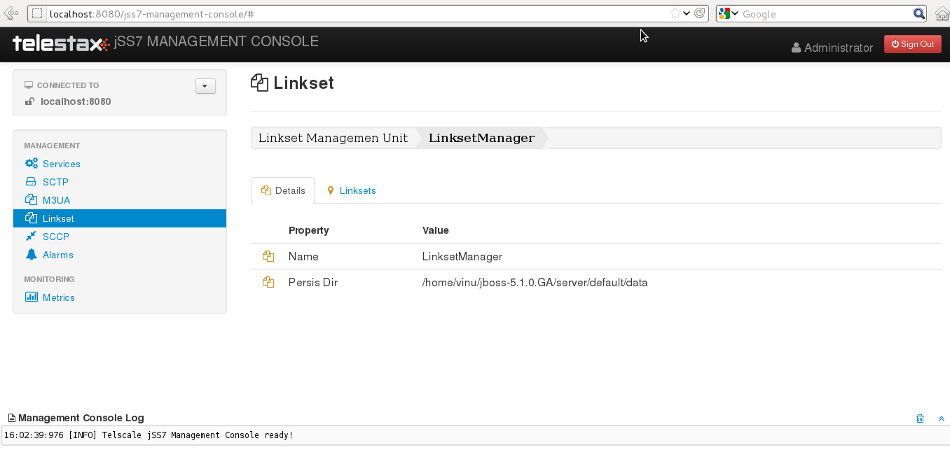

[[_managing_linksets]]
= Linkset Management

[[_managing_linksets_using_cli]]
== Using CLI

You can manage Linksets and Links using CLI or GUI.
You can create, delete, activate and deactivate linksets and links using the Shell command `linkset` with appropriate parameters.
The `linkset` command can be used only when dahdi based cards are configured.                

[[_managing_linksets_using_gui]]
== Using GUI

The GUI will allow you to manage your linksets and links efficiently using a user-friendly interface.
Open a Web Browser and navigate to http://localhost:8080/jss7-management-console/. Click on the 'linkset' link in the left panel.
The main panel will display the names of all configured Linkset Management units.
To configure or view the settings of a particular Linkset Management Unit you must click on the name of that unit.
The GUI will look similar to the figure below and is divided into two tabs. 

.GUI - Linkset Management

The first tab will display the properties of the Linkset Management unit.
These details displayed here are fetched from the XML descriptor file [path]_jboss-beans.xml_, which is  located at [path]_$JBOSS_HOME/server/profile_name/deploy/restcomm-ss7-service/META-INF_, where  [app]`profile_name` is the server profile name.
These properties cannot be modified here in the GUI.
To modify them you must modifiy the [path]_jboss-beans.xml_ and restart the Server.
The GUI will then display the modified values.
 

The other tab will allow you to manage all Linksets and Links within this Linkset Management unit.
 

[[_shell_linkset_show]]
== View all Linksets and Links

[[_shell_linkset_show_cli]]
=== Using CLI

You can view the current status of all correctly configured Linksets and Links by issuing the command `linkset show` as described below: 

----

Name
	linkset show

SYNOPSIS
	linkset show

DESCRIPTION
	This command is used to view all Links and Linksets and their states. 

	The possible states of a Linkset are:

	- UNAVAILABLE	:	Indicates that the Linkset does not have any 'available' 
				links and cannot transport traffic.

	- SHUTDOWN	:	Indicates that Linkset has been shutdown.

	- AVAILABLE	:	Indicates that the Linkset has atleast one 'available' 
				link and can transport traffic.

	The possible states of a Link are:

	- UNAVAILABLE	:	Indicates that the Link is not 'available' to transport
				traffic. A Link is 'unavailable' if the Link is remotely 
				or locally inhibited by a user. It can also be 
				'unavailable' if MTP2 has not been able to successfully 
				activate the link connection.

	- SHUTDOWN	:	Indicates the Link has been shutdown in the configuration. 

	- AVAILABLE	:	Indicates the Link is active and 'available' to transport 
				traffic.

	- FAILED	:	Indicates that the Link is not 'shutdown' but is 
				'unavailable' at Layer 2 for some reason. For example, the
				Initial Alignment may fail, or the link test messages sent
				by MTP 3 are not being acknowledged.
----

[[_shell_linkset_show_gui]]
=== Using GUI

Navigate to the specific Linkset Management unit and switch to the 'Linksets' tab.
Here you can view a list of all the Linksets created.
Every correctly configured Linkset will be displayed in a row and for each Linkset, the first column will display the name of the Linkset.
The icon adjacent to the name will be lit 'green' if the Linkset is currently active or 'orange' if inactive.
The second column will indicate the current mode of the Linkset (Configured / Not Configured), the third column will allow you to activate / deactivate the Linkset and the fourth column will allow you to delete the Linkset. 

To view the details of all the Links created within a specific Linkset click on the name of the Linkset whose details you wish to view.
This will launch the 'Links' view and display all the configured properties of the selected Linkset in the first tab.
The second tab in this view will allow you to view all Links in this particular Linkset.
You can click on any Link name here to view the configured properties.
You can click on the bread crumbs at the top to return to any of the previous pages you navigated through. 

[[_shell_linkset_create]]
== Create a new Linkset

[[_shell_linkset_create_cli]]
=== Using CLI

You can create a new Linkset by issuing the command `linkset create` with appropriate parameters as described below: 

----

Name
	linkset create

SYNOPSIS
	linkset create dahdi opc <point-code> apc <point-code> ni <network-id> 
	<linkset-name>

DESCRIPTION
	This command is used to create a new Linkset of type Dahdi as explained below. You 
	must ensure that appropriate linkset factories are deployed prior to creating any 
	linkset.

PARAMETERS
	opc <point-code> 		-	MTP Point code of the originating 
						signalling point. Takes an Integer Value. 

	apc <point-code>		-	MTP  Point code of the adjacent signalling 
						point. Takes an Integer Value.

	ni <network-id> 		-	Network Identifier and should be one of 
						the following values
							0 - International Network
							1 - Spare (for International use)
							2 - National Network
							3 - Reserved for National use

	<linkset-name>			-	Name of the Linkset to be created. This 
						will be used to identify the linkset. 
						Takes a String value.

EXAMPLES	
	linkset create dahdi opc 3 apc 4 ni 0 dahdilinkset1

	The above command will create a new linkset of type Dahdi and name dahdilinkset1. 
	The originating point code value is 3 and the adjacent point code value is 4 and 
	the network is an international network.
----

[[_shell_linkset_create_gui]]
=== Using GUI

.Procedure: Create new Linkset using GUI
. In the section for Linksets in the Linkset Management Unit window, click on the 'Create Linkset' button.
  This will launch a pop-up 'Create Linkset'.
. In the 'Create Linkset' pop-up, add details of the new Linkset.
  You must ensure that you fill in all the mandatory parameters (OPC, DPC, NI and Linkset Name). For definition of these parameters, please refer to the description of the CLI command for the same in the preceding section. 
. Verify the details entered and then click on the 'Create' button.
  A new Linkset will be created with parameters as specified.
  If there is an error in creating the Linkset then you will find the details of the error in the Management Console Log section below.
. Click on the 'Close' button to close the 'Create Linkset' pop-up. 

[[_shell_linkset_delete]]
== Remove a Linkset

[[_shell_linkset_delete_cli]]
=== Using CLI

You can delete an existing Linkset by issuing the command `linkset delete` with appropriate parameters as described below: 

----

Name
	linkset delete

SYNOPSIS
	linkset delete <linkset-name>

DESCRIPTION
	This command is used to delete an existing Linkset.

PARAMETERS
	<linkset-name>		-	Name of the Linkset to be deleted.

EXAMPLE
	linkset delete dahdilinkset1

	The above command will delete the Linkset identified by the name dahdilinkset1.
----

[[_shell_linkset_delete_gui]]
=== Using GUI

.Procedure: Delete Linkset using GUI
. Navigate to the 'Linksets' section in the Linkset Management Unit window and locate the row corresponding to the Linkset you wish to delete.
. You must ensure that the Linkset is deactivated prior to deletion.
  If the Linkset is deactivated, the last column for 'Delete' will display a 'x' button in red and will be enabled.
  If the Linkset is currently active, the 'x' button will be disabled.
  You can only delete the Linkset if it is not active.
. Click on the red 'x' button to delete the corresponding Linkset.

[[_shell_linkset_activate]]
== Activate Linkset

[[_shell_linkset_activate_cli]]
=== Using CLI

You can activate an existing Linkset by issuing the command `linkset activate` with appropriate parameters as described below: 

----

Name
	linkset activate

SYNOPSIS
	linkset activate <linkset-name>

DESCRIPTION
	This command is used to activate an existing Linkset.

PARAMETERS
	<linkset-name>		-	Name of the Linkset to be activated.

EXAMPLE
	linkset activate dahdilinkset1
	
	The above command will activate the Linkset identified by the name dahdilinkset1.
----

[[_shell_linkset_activate_gui]]
=== Using GUI

.Procedure: Activate a Linkset using GUI
. Navigate to the 'Linksets' section in the Linkset Management Unit window and locate the row corresponding to the Linkset you wish to activate.
. Click on the 'Activate' button in the actions column to activate the corresponding Linkset. 
. If the Linkset has been activated successfully you will find the status indicating the Linkset as 'Available' and the Linkset's icon will be lit green.
  If there is an error and the Linkset failed to activate, you will find details of the error in the Management Console log below.

[[_shell_linkset_deactivate]]
== Deactivate Linkset

[[_shell_linkset_deactivate_cli]]
=== Using CLI

You can deactivate a currently active Linkset by issuing the command `linkset deactivate` with appropriate parameters as described below: 

----

Name
	linkset deactivate

SYNOPSIS
	linkset deactivate <linkset-name>

DESCRIPTION
	This command is used to deactivate an existing Linkset.

PARAMETERS
	<linkset-name>		-	Name of the Linkset to be deactivated.

EXAMPLE
	linkset deactivate dahdilinkset1
	
	The above command will deactivate the Linkset identified by the name dahdilinkset1.
----

[[_shell_linkset_deactivate_gui]]
=== Using GUI

.Procedure: Deactivate a Linkset using GUI
. Navigate to the 'Linksets' section in the Linkset Management Unit window and locate the row corresponding to the Linkset you wish to deactivate.
. To deactivate a Linkset currently active, click on the 'Deactivate' button in the actions column of the row corresponding to the Linkset.

[[_shell_linkset_link_create]]
== Create a new Link

[[_shell_linkset_link_create_cli]]
=== Using CLI

You can create a new Link by issuing the command `linkset link create` with appropriate parameters as described below: 

----

Name
	linkset link create

SYNOPSIS
	linkset link create span <span-num> code <code-num> channel <channel-num> 
	<linkset-name> <link-name>

DESCRIPTION
	This command is used to create a new Link within a Linkset. The Linkset must be 
	created prior to executing this command.

PARAMETERS
	span <span-num> 	-	Port number in the Card (indexed from 0). 
					Takes an Integer Value.

	code <code-num>		-	Signaling Link code
					SLS (Signaling link selection) assigned to this 
					Link. Takes an Integer Value.

	channel <channel-num> 	-	Time Slot number (TDM time slot).
					Takes an Integer Value.

	<linkset-name>		-	Name of the Linkset within which the new Link is
					being created. 
	
	<link-name>		- 	Name of the Link to be created. This will be used 
					to identify the Link. Takes a String value.

EXAMPLES
	linkset link create span 1 code 1 channel 1 linkset1 link1
	
	The above command will create a new Link identified as link1 within an existing 
	Linkset identified as linkset1.
----

[[_shell_linkset_link_create_gui]]
=== Using GUI

.Procedure: Create new Link using GUI 
. In the section for Links in the Linkset Management Unit window, click on the 'Create Link' button.
  This will launch a pop-up 'Create Link'.
. In the 'Create Link' pop-up, add details of the new Link.
  You must ensure that you fill in all the  parameters.
  For definition of these parameters, please refer to the description of the CLI command for the same in the preceding section. 
. Verify the details entered and then click on the 'Create' button.
  A new Link will be created with parameters as specified.
  If there is an error in creating the Link then you will find the details of the error in the Management Console Log section below.
. Click on the 'Close' button to close the 'Create Link' pop-up. 

[[_shell_linkset_link_delete]]
== Remove a Link

[[_shell_linkset_link_delete_cli]]
=== Using CLI

You can delete an existing Link by issuing the command `linkset link delete` with appropriate parameters as described below: 

----

Name
	linkset link delete

SYNOPSIS
	linkset link delete <linkset-name> <link-name>

DESCRIPTION
	This command is used to delete an existing Link within a Linkset.

PARAMETERS
	<link-name>		- 	Name of the Link to be deleted. 

	<linkset-name>		-	Name of the Linkset within which the Link resides. 

EXAMPLE
	linkset link delete linkset1 link1
	
	The above command will delete the Link identified by the name Link1 within the
	Linkset linkset1.
----

[[_shell_linkset_link_delete_gui]]
=== Using GUI

.Procedure: Delete Link using GUI
. Navigate to the 'Links' section in the Linkset Management Unit window and locate the row corresponding to the Link you wish to delete.
. You must ensure that the Link is deactivated prior to deletion.
  If the Link is inactive, the last column for 'Delete' will display a 'x' button in red.
  If the Link is currently active, the 'x' button will be displayed in orange.
  You can only delete the Link if it is inactive and the 'x' button is displayed in red.
. Click on the red 'x' button to delete the corresponding Link instance.

[[_shell_linkset_link_activate]]
== Activate Link

[[_shell_linkset_link_activate_cli]]
=== Using CLI

You can activate an existing Link by issuing the command `linkset link activate` with appropriate parameters as described below: 

----

Name
	linkset link activate

SYNOPSIS
	linkset link activate <linkset-name> <link-name>

DESCRIPTION
	This command is used to activate an existing Link within a Linkset.

PARAMETERS
	<link-name>		- 	Name of the Link to be activated. 

	<linkset-name>		-	Name of the Linkset within which the Link resides. 

EXAMPLE
	linkset link activate linkset1 link1
	
	The above command will activate the Link identified by the name Link1 within the 
	Linkset linkset1.
----

[[_shell_linkset_link_activate_gui]]
=== Using GUI

.Procedure: Activate Link using GUI
. Navigate to the 'Links' section in the Linkset Management Unit window and locate the row corresponding to the Link you wish to activate.
. Click on the 'Activate' button to activate that Link within the Linkset.

[[_shell_linkset_link_deactivate]]
== Deactivate Link

[[_shell_linkset_link_deactivate_cli]]
=== Using CLI

You can deactivate a currently active Link by issuing the command `linkset link deactivate` with appropriate parameters as described below: 

----

Name
	linkset link deactivate

SYNOPSIS
	linkset link deactivate <linkset-name> <link-name>

DESCRIPTION
	This command is used to deactivate an existing Link within a Linkset.

PARAMETERS
	<link-name>		- 	Name of the Link to be deactivated. 

	<linkset-name>		-	Name of the Linkset within which the Link resides. 

EXAMPLE
	linkset link deactivate linkset1 link1
	
	The above command will deactivate the Link identified by the name Link1 within the
	Linkset linkset1.
----

[[_shell_linkset_link_deactivate_gui]]
=== Using GUI

.Procedure: De-activate Link using GUI
. Navigate to the 'Links' section in the Linkset Management Unit window and locate the row corresponding to the Link you wish to deactivate.
. Click on the 'Deactivate' button to deactivate that Link within the Linkset.